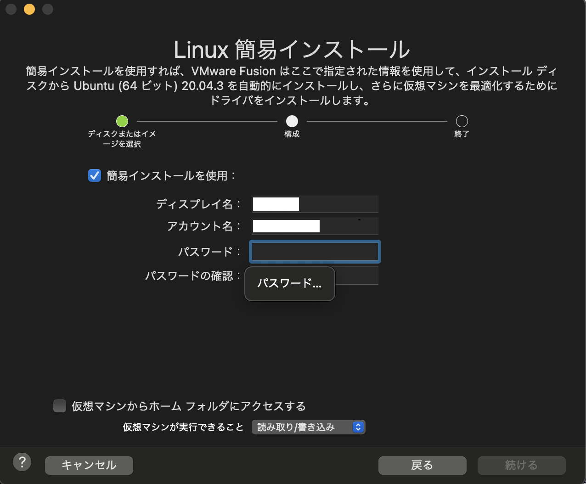

# VMware Fusion上でのUbuntu 20.04のインストール
[前のページ](../../mac/)

[目次](../../../../)

## 概要
VMware FUsionによる仮想マシンにUbuntu 20.04をインストールします．VMware Fusionのインストールが済んでいない方は以前のページをご覧ください．

参考：[VMware FusionにUbuntuをインストール](https://book.studio947.net/article/4518/)

## 手順
### Ubuntu20.04 isoイメージのダウンロード
以下のサイトにアクセスし，Ubuntu 20.04のisoイメージ（インストーラ）をダウンロードします．
https://jp.ubuntu.com/download

### VMwareにインストール
VMwareを開きます．先程ダウンロードしたisoイメージを「ディスクまたはイメージからインストール」の枠にドラッグします．

すると以下のような画面に遷移します．続けるを押します．

ログイン情報等を入れます．
- ディスプレイ名：ログイン画面で表示される名前です．
- アカウント名：端末 (Terminal) と呼ばれる画面に表示される名前です．
小文字、0 ～ 9 の数字、ダッシュのみを使用できます．
- パスワード

終了を押します．

以下の画面に遷移します．

再生ボタンをクリックするとインストールが開始されます．

数十分かかるので，気長に待ちましょう．

途中これが出てきたら，OKで大丈夫です．

問題がなければそのままインストールが終了します！

↓Windows版VMwareの画面ですが，インストールが終了するとこのようなデスクトップ画面になります．

それでは，次のページでこのUbuntuにROSをインストールします．

## リンク
[次のページ](../../../ros/)

[目次](../../../)

## 余談
Macはデフォルトの仮想メモリ量とCPU数で問題なさそうだったので書きませんでしたが，Windows版の記事ではGazeboシミュレータを動かすためにデフォルトから値を変更して増強する方法を載せています．
Macでのやり方も一応記載しておきます．

[vmwareの公式説明](https://docs.vmware.com/jp/VMware-Fusion/12/com.vmware.fusion.using.doc/GUID-35CD7A6F-2820-40B1-AB3A-59F2499B3AC1.html)

左上当たりのレンチのマークを押し，設定画面を出します．

プロセッサとメモリを選択します．

この画面で変更できます．

Windowsではメモリを4096MB，プロセッサ数を4に変更するようにしていますが，Macでは機種によってはプロセッサ数2がデフォルトで4にしようとするとwarningが出るものもあります．そのような場合は変更しなくてよいと思います．