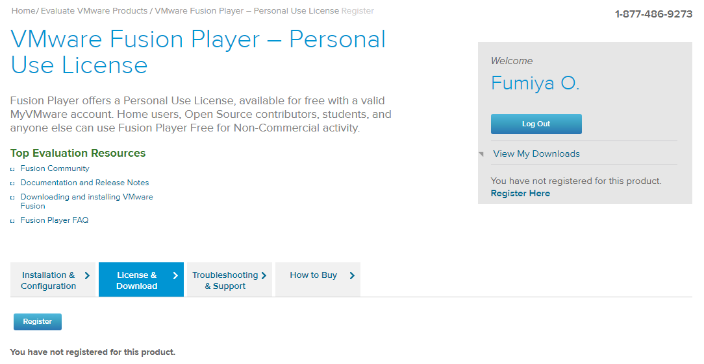

# MacにVMware Fusion Player 12 をインストール 
[前のページ](../../)

[目次](../../../)

## 概要

Mac OSのPCにVMWare Fusion Player 12をインストールします．

途中手順通りにいかない場合があります．その際はトラブルシューティングの章を参考にしてください．

また，PCのストレージは20GBほど空きがあることが望ましいです．

## 手順

参考：[macOS用VMware Fusionの無償版を利用する](https://officeforest.org/wp/2020/09/19/macos%E7%94%A8vmware-fusion%E3%81%AE%E7%84%A1%E5%84%9F%E7%89%88%E3%82%92%E5%88%A9%E7%94%A8%E3%81%99%E3%82%8B/)

### 無償ライセンスキーを取得
1. [myvmware](https://my.vmware.com/)にアクセス
2. 右上のRegisterを押しアカウント登録
    - 電話番号、住所等求められます
    - individualを選択します
    - 最後にsign upをクリック
3. メールが届きます (Gmailで届かない場合はプロモーションのほうにメールが入っている可能性があります（私はそうでした）)
    - アカウントを有効にしますをクリック
4. [VMware Fusion Playerのインストールページ](https://my.vmware.com/group/vmware/evalcenter?p=fusion-player-personal)←クリック
5. registerをクリック

    

    - Company or Organizationは自身の所属する大学名等にするとよいでしょう
    - 規約を確認して問題なければsign up
6. Lisence keyが表示されるので控えをとる
7. Download PackagesのManually DownloadをクリックしVMware Fusionをダウンロード

### VMware Fusionのインストール

## トラブルシューティング
- インストーラが起動できない

    インストーラを実行すると再起動を求められることがありました．（画像が無くて申し訳ありません）

    この時は，素直に再起動をすることでインストーラが実行できるようになりました．

    おそらく，[この現象](https://docs.vmware.com/jp/VMware-Tools/11.3.0/com.vmware.vsphere.vmwaretools.doc/GUID-737341FF-1AD7-4006-B904-8867FB557147.html)です．

    再起動しても直らない場合は，[このリンク先](https://support.microsoft.com/ja-jp/topic/%E6%9C%80%E6%96%B0%E3%81%AE%E3%82%B5%E3%83%9D%E3%83%BC%E3%83%88%E3%81%95%E3%82%8C%E3%82%8B-visual-c-%E3%81%AE%E3%83%80%E3%82%A6%E3%83%B3%E3%83%AD%E3%83%BC%E3%83%89-2647da03-1eea-4433-9aff-95f26a218cc0)からMicrosoft Visual C++ 再頒布可能パッケージを手動でインストールしてみてください．
32bit PCの場合x86，64bit PCの場合x64をインストールしましょう．

## リンク
[次のページ](../install-ubuntu/)

[目次](../../../)