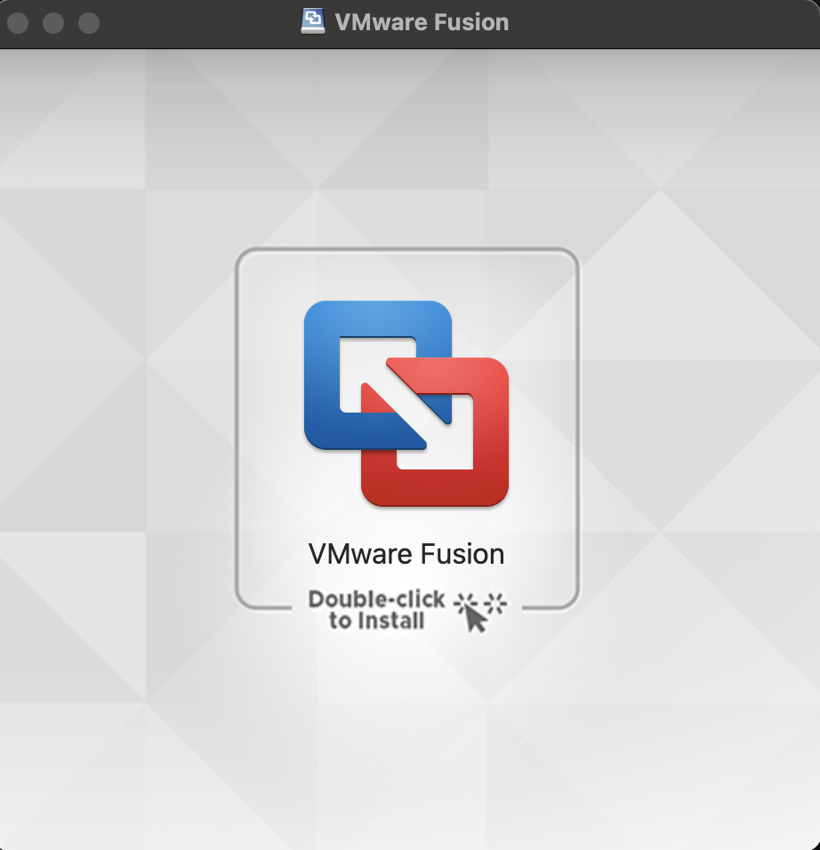
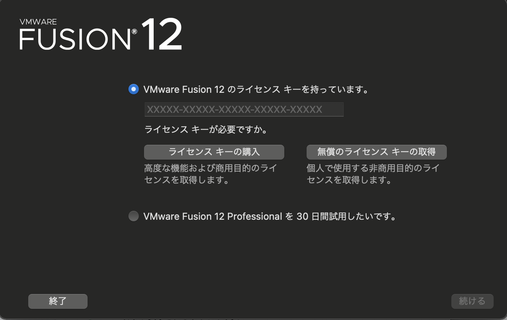
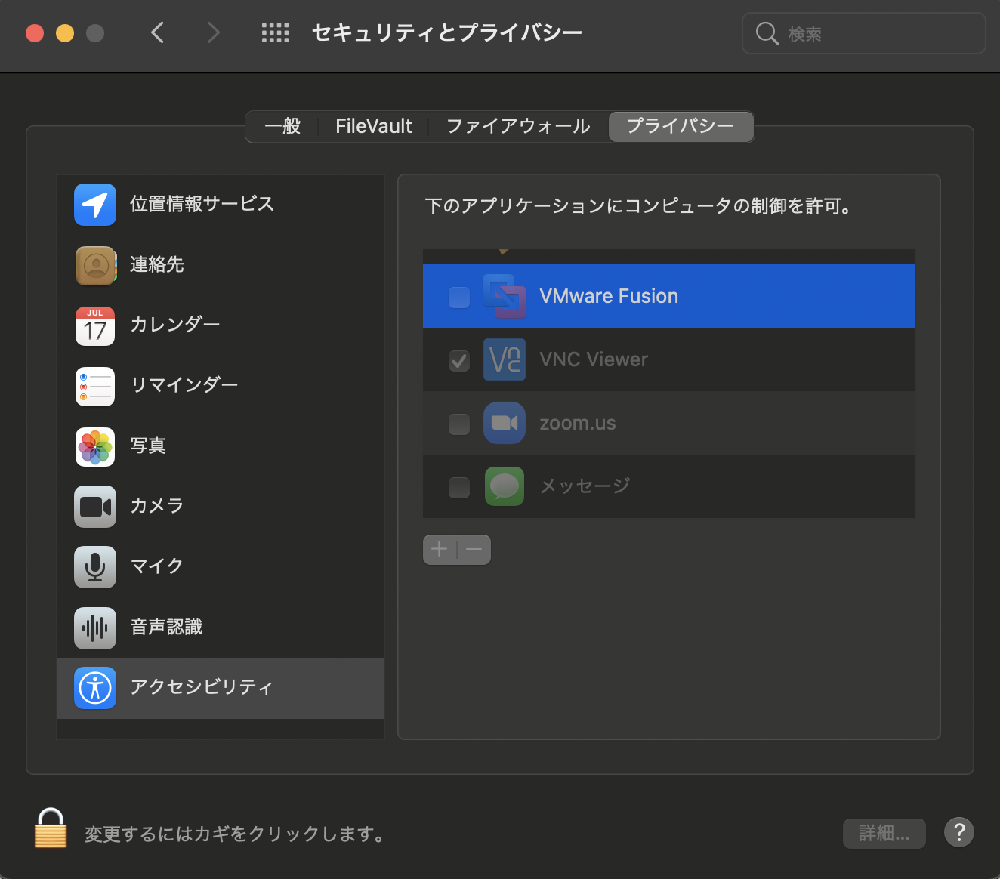
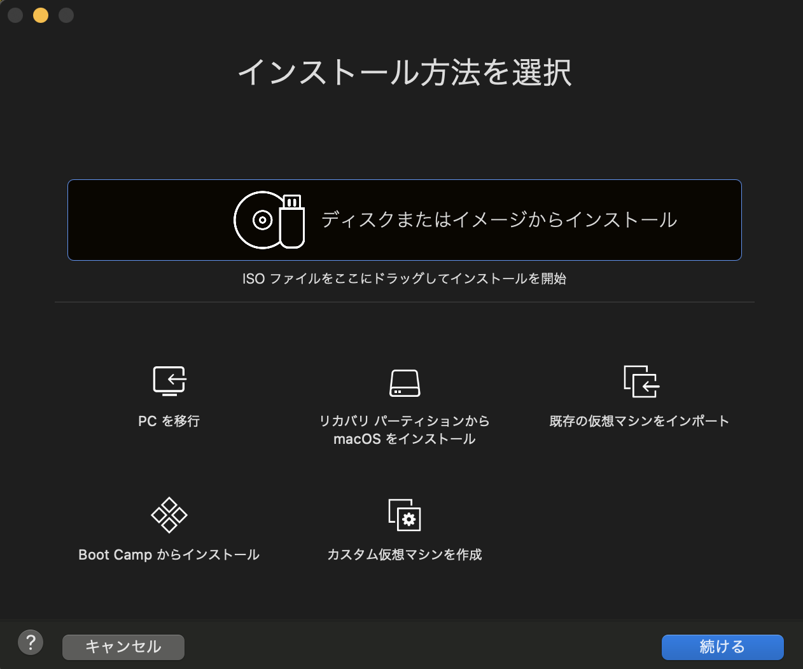

# MacにVMware Fusion Player 12 をインストール 
[前のページ](../../)

[目次](../../../)

## 概要

Mac OSのPCにVMWare Fusion Player 12をインストールします．

PCのストレージは20GBほど空きがあることが望ましいです．

## 手順

参考：[macOS用VMware Fusionの無償版を利用する](https://officeforest.org/wp/2020/09/19/macos%E7%94%A8vmware-fusion%E3%81%AE%E7%84%A1%E5%84%9F%E7%89%88%E3%82%92%E5%88%A9%E7%94%A8%E3%81%99%E3%82%8B/)

### 無償ライセンスキーを取得
1. [myvmware](https://my.vmware.com/)にアクセス
2. 右上のRegisterを押しアカウント登録
    - 電話番号、住所等求められます
    - individualを選択します
    - 最後にsign upをクリック
3. メールが届きます （Gmailで届かない場合はプロモーションのほうにメールが入っている可能性があります）
    - アカウントを有効にしますをクリック
4. [VMware Fusion Playerのインストールページ](https://my.vmware.com/group/vmware/evalcenter?p=fusion-player-personal)←クリック
5. registerをクリック

    

    - Company or Organizationは自身の所属する大学名等にするとよいでしょう
    - 規約を確認して問題なければsign up
6. Lisence keyが表示されるので控えをとる
7. Download PackagesのManually DownloadをクリックしVMware Fusionをダウンロード
    - ダウンロードしたdmgファイルをクリック

### VMware Fusionのインストール
1. 以下が表示される．ダブルクリック

    

2. Double-click to installをクリック． 出てくるウィンドウの右上にある「VMware Fuionを開く」を押す． その後パスワード等求められるので入力する．

3. 利用規約を読み， よければ承認する．

4. アカウント登録の際に控えたライセンスキーを入力し， 次へを押す

    

5. 認証される．

    「アクセシビリティにアクセスできません」と表示された場合はOKを押すと，「VMware Fusionはアクセシビリティ機能を使用してこのコンピュータを制御することを求めています」という旨のメッセージが表示されるので，「"システム環境設定"を開く」を押す．以下のような画面が出るので鍵マークを押す．パスワードが求められるので入力する．すると変更できるようになるのでVMware Fusionにチェックマークを入れる．

   

以上でMacへのVMware Fusionのインストールは終了です．
以下の画面が出ている状態になっていると思います．

次に，VMwareにUbuntu 20.04をインストールしていきます．

## リンク
[次のページ](../install-ubuntu/mac)

[目次](../../../)