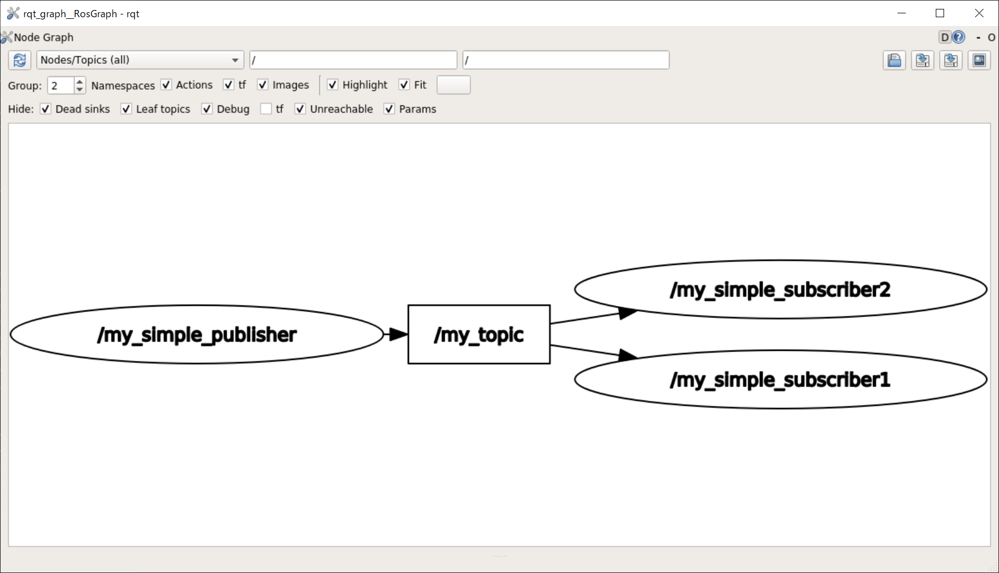
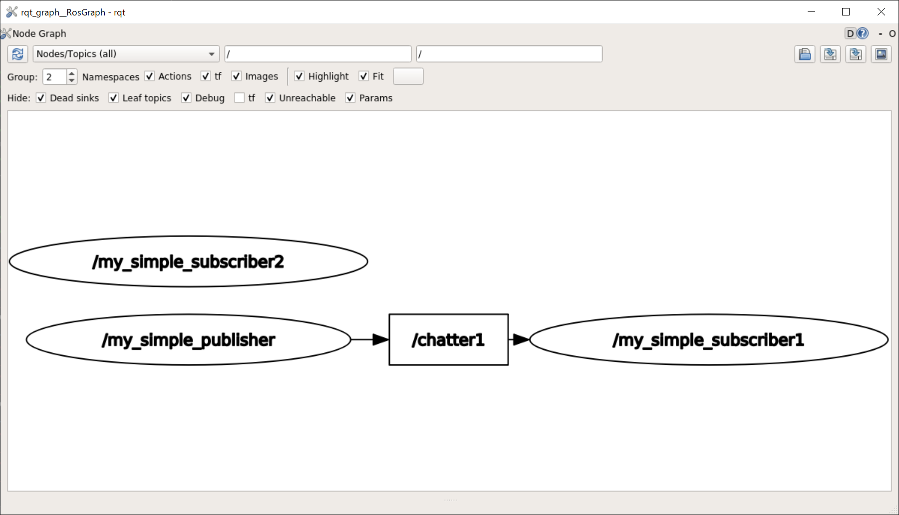
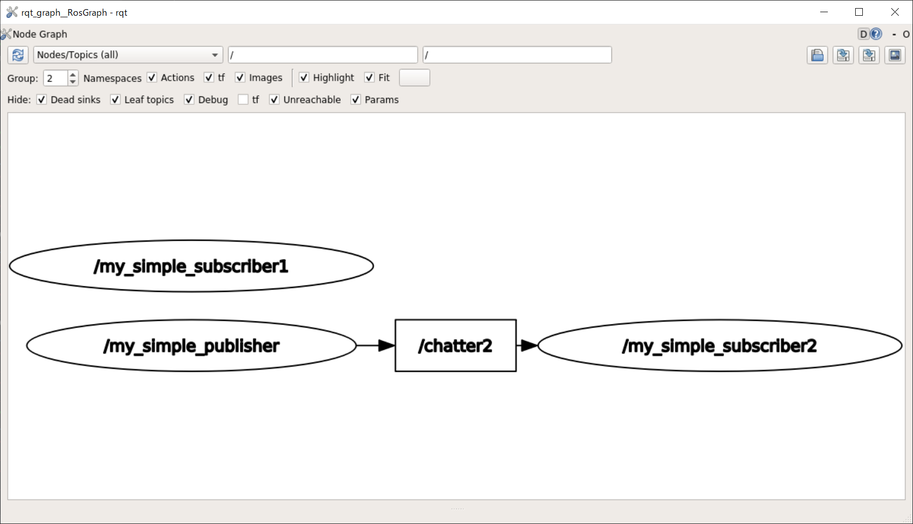

# roslaunch

[前のページ](../rosparam)

[目次](../../)


## 概要
複数のノードを同時に起動したりそれぞれにパラメータを渡したりすることを一つのファイルで記述可能なroslaunchについて説明します．

## ノードの起動
my_ros_tutorial配下（srcやincludeディレクトリがあると思いますが，それと同階層のところ）にlaunchディレクトリを作成します．

その中に，my_tutorial.launchという.launchという拡張子のファイルを作成し，以下の内容をコピペしましょう．

```xml
<launch>
  <node pkg="my_ros_tutorial" type="my_simple_publisher" name="my_simple_publisher"/>
  <node pkg="my_ros_tutorial" type="my_simple_subscriber" name="my_simple_subscriber" output="screen"/>
</launch>
```

**説明**

launchファイルの文法は[XML](https://www.cybertech.co.jp/xml/contents/xmlxmldb/serial/_xmlbeginner1.php)に近いです．

```xml
  <node pkg="my_ros_tutorial" type="my_simple_publisher" name="my_simple_publisher"/>
```
nodeの起動にはnodeタグを使用します．pkgにはパッケージ名，typeにはノードの実行ファイル名を指定します．ここまではrosrunと同じですね．

追加で，nameで起動するノードの名前を決めることができます．ROS上ではここで決めた名前でノードが認識されます．（rosrunの場合は，コードのros::initで指定された名前がノードの名前になります）

上記のnodeタグを複数個launchファイルに記述することで複数ノードを同時に立ち上げることができます．

なお，subscriberのほうには`output="screen"`という記述がありますが，これを書くことでノードの出力がターミナルに表示されるようになります．逆に，この記述がないpublisherはROS_INFO等による標準出力がターミナルに表示されません．

**実行**

ターミナルで以下を打つとlaunchファイルを実行できます．

```shell
roslaunch my_ros_tutorial my_tutorial.launch
```
`roslaunch （パッケージ名） （launchファイル名）`です．なお，roslaunch時にroscoreが立ち上がっていない場合，自動でroscoreも立ち上がるので，rosrunと異なり事前にroscoreする必要もありません．

また，launchファイルを変更した際はcatkin buildする必要がありません．cppを変更した際は実行ファイルを作成しなおすためにビルドが必要でしたが，launchの変更はノードの実行様式を変更するだけであって実行ファイルの変更は伴わないのでビルドは必要ありません．

以下では，nodeタグのオプションについて説明します．

### ノード名の変更
```xml
<launch>
  <node pkg="my_ros_tutorial" type="my_simple_publisher" name="my_simple_publisher"/>
  <node pkg="my_ros_tutorial" type="my_simple_subscriber" name="my_simple_subscriber1" output="screen"/>
  <node pkg="my_ros_tutorial" type="my_simple_subscriber" name="my_simple_subscriber2" output="screen"/>
</launch>
```
my_tutorial.launchを上記のように変更してみましょう．my_simple_subscriberという実行ファイル名のノードを"my_simple_subscriber1"，"my_simple_subscriber2"と名前を変えて2つ実行してみます．
```shell
rqt_graph
```
でノードとトピックの関係性を可視化してみましょう．



このように，同じ機能のノードを容易に二つに複製できたと思います．ロボット開発では，例えば足回りの4つのモータユニットを動かすためにそれぞれのユニットに対応するROSノードを用意したい時があります．そういう時にroslaunchを用いると，4つのノードの名前が異なるように起動してやることで容易に対応することができます．

### remap
```xml
<launch>
  <node pkg="my_ros_tutorial" type="my_simple_publisher" name="my_simple_publisher" output="screen">
    <remap from="my_topic" to="chatter1"/>
  </node>
  <node pkg="my_ros_tutorial" type="my_simple_subscriber" name="my_simple_subscriber1" output="screen">    
    <remap from="my_topic" to="chatter1"/>
  </node>
  <node pkg="my_ros_tutorial" type="my_simple_subscriber" name="my_simple_subscriber2" output="screen">    
    <remap from="my_topic" to="chatter2"/>
  </node>
</launch>
```
先ほどのlaunchにremapタグを追記しました．
```xml
<remap from="元のトピック名" to="変更後のトピック名"/>
```
とすることで，ノードのパブリッシュ，サブスクライブするトピックの名前を変更することができます．

ここでrqt_graphを実行してどのようになっているか見てみましょう．



/my_simple_publisherが/chatter1という名前のトピックをpublishし，/my_simple_subscriber1がそれをsubscribeしています．

/my_simple_subscriber2は/chatter2をsubscribeすることになっていますが，/chatter2を誰もpublishしていないので浮いていますね．

それでは，ここでmy_simple_publisherのremapをchatter2に変更してみましょう．
```xml
  <node pkg="my_ros_tutorial" type="my_simple_publisher" name="my_simple_publisher" output="screen">
    <remap from="my_topic" to="chatter2"/>
  </node>
```

rqt_graphは以下のようになります．



/my_simple_publisherが/chatter2というトピックをpublishし，/my_simple_subscriber2がそれをsubscribeする構図になりました．

この二つの図を比較すると，remapによってノード間の接続の構図が変化したことが見て取れます．
このように，remapタグを用いて適宜トピック名を変更することでノード間の接続を変更したり，あるいはダウンロードしてきたROS nodeを自分の構築したシステムに組み込むことが可能です．

### param
```xml
<launch>
    <node pkg="my_ros_tutorial" type="my_simple_publisher" name="my_simple_publisher" output="screen">
        <param name="pub_string" value="introduction-to-ros"/>
    </node>
    <node pkg="my_ros_tutorial" type="my_simple_subscriber" name="my_simple_subscriber" output="screen"/>
</launch>
```

一番初めの二つのノードを起動するlaunchファイルにparamタグを追記しました．
```xml
<param name="パラメータ名" value="値"/>
```
とすることで，ノードにパラメータを渡すことができます．前のページで"pub_string"という名前のパラメータを受け取れるようにノードのコードを書きましたが，このようにしてlaunchファイルではパラメータを渡すことが可能です．

## launchファイル上の変数と単純な条件分岐
```xml
<launch>
    <arg name="mode" default="true"/>
    <group if="$(arg mode)">
        <node pkg="my_ros_tutorial" type="my_simple_publisher" name="my_simple_publisher" output="screen"/>
        <node pkg="my_ros_tutorial" type="my_simple_subscriber" name="my_simple_subscriber" output="screen"/>
    </group>
</launch>
```
```xml
<arg name="変数の名前" default="デフォルトの値"/>
```
とすると，launchファイル上で変数を定義できます．
上記launchファイルでは，modeという名前の変数を定義し，デフォルトではtrueというbool値を入れています．

なお，argで指定できる値の型は文字列型 (string)，数値型 (double)，論理型 (bool) です．

また，groupタグを用いるとタグ内部に記述された内容をグルーピングすることができ，特に`<group if=論理値>`とするとgroupタグ内の内容をtrueのとき実行，falseのとき実行しないようにできます．
（ちなみに，`<group unless=論理値>`とすると，falseの時実行，trueの時実行しないようになります．）

今回は`<group if="$(arg mode)">`としており，この場合はmode変数の値がtrueの時はgroup内実行（2つのノード起動），falseの場合は実行されません．実際にlaunchを実行して動作を確認してみましょう．

なお，
```
roslaunch my_ros_tutorial my_tutorial.launch mode:=false
```
のようにして，コマンド上からlaunchの変数の値を変更することも可能です．rosrunオプションと異なり，この際はパラメータ名の前に_はいりません．

## evalを用いた複雑な条件分岐

```xml
<launch>
    <arg name="mode" default="mode1"/>
    <group if="$(eval mode=='mode1' or mode=='mode2')">
        <node pkg="my_ros_tutorial" type="my_simple_publisher" name="my_simple_publisher" output="screen"/>
        <node pkg="my_ros_tutorial" type="my_simple_subscriber" name="my_simple_subscriber" output="screen"/>
    </group>
</launch>
```
```xml
<group if="$(eval mode=='mode1' or mode=='mode2')">
```
のように，evalを用いると単純なtrue, falseだけでなく文字列比較やand ,or 等の複雑な条件分岐を行えます．このevalは[pythonのeval()](https://docs.python.org/ja/3.6/library/functions.html#eval)と同じです．

この場合，modeの値が"mode1"か"mode2"のときに実行されます．


## 別のlaunchファイルのインクルード
説明のために，my_publisher.launch，my_subscriber.launchという2つのlaunchファイルを作成します．

#### my_publisher.launch
```xml
<launch>
    <arg name="pubstring" default="hello"/>
    <arg name="looprate" default="5"/>
    <node pkg="my_ros_tutorial" type="my_simple_publisher" name="my_simple_publisher" output="screen">
        <param name="pub_string" value="$(arg pubstring)"/>
        <param name="looprate" value="$(arg looprate)"/>
    </node>
</launch>
```
これまで紹介してきた内容で理解できると思います．pubstring, looprateというlaunchファイルの変数を定義し，nodeの起動時にparamタグでパラメータを渡す際にlaunchファイルの変数の値を与えています．また，ここではpublisherのみ起動しています．

#### my_subscriber.launch
```xml
<launch>
    <include file="$(find my_ros_tutorial)/launch/my_publisher.launch">
        <arg name="pubstring" value="hoge" />
        <arg name="looprate" value="1" />
    </include>
    <node pkg="my_ros_tutorial" type="my_simple_subscriber" name="my_simple_subscriber" output="screen"/>
</launch>
```
新しくincludeタグが登場します．

`<include file=（取り込みたいlaunchファイルのパス）/>`で別のlaunchファイルを取り込んで一緒に実行することができます．`$(find my_ros_tutorial)`のようにしてROSパッケージのパスが取得でき，そこからの相対パスでlaunchの場所を指定できます．

また，ここではさらにargタグを追記しています．
```xml
<arg name="変数名" value="値"/>
```
とすることで，includeで読み込むlaunchファイルに変数値を渡すことができます．
nodeタグでいうparamタグと関係性は近いですね．

さて，ここでmy_subscriber.launchを実行するとどのような挙動をするでしょうか？ぜひ予想してから
```
roslaunch my_ros_tutorial my_subscriber.launch
```
を実行してみましょう．
publisher, subscriberともに実行されますが，publisherは"hoge"という文字列を1Hzでpublishすると思います．

ロボットシステムが複雑になると，センサ起動用launchファイル，自己位置推定用launchファイル，経路計画用launchファイル等，用途に分けてlaunchを書いて最終的にincludeで一つに統合すると見やすくなります．

以上のことを知っておけば大体のlaunchファイルは解読できると思います！


## リンク

[次のページ](../rcomand/)

[目次](../../)

