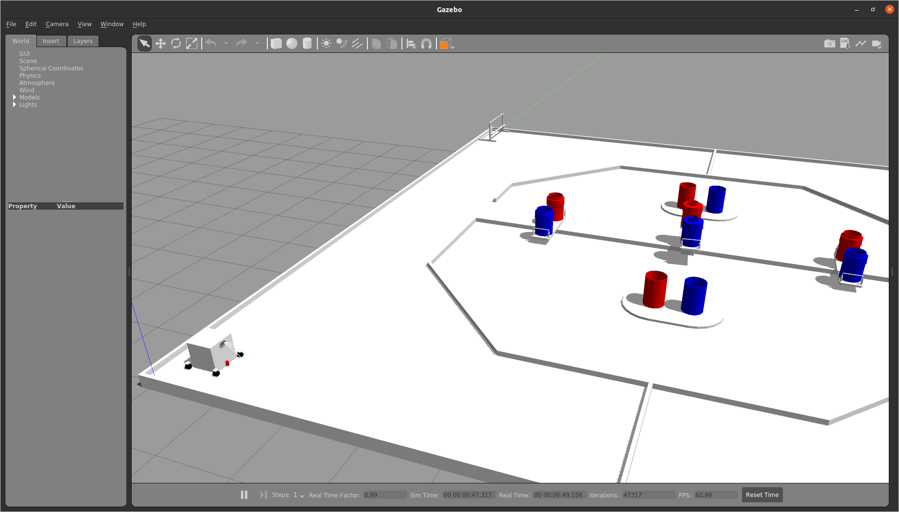

# Gazeboとは

[前のページ](../../rviz/practice)

## Gazeboとは

Gazeboとは，ROSと相性の良い物理シミュレータです．
URDFで記述したロボットモデルをGazebo上にスポーンさせ，ROSトピックを投げることでシミュレーション空間上でロボットを動かすことができます．その他の障害物等も再現することができ，ロボットが実際に動作するフィールドを再現することで実機を動かす前にROSのシステムが正しく動作するかを確認することができます．

## 使用例

この写真では，ロボットの通る経路や周囲の障害物情報，地図，自己位置推定のパーティクル等が可視化されています．

前回作成したROSトピックは文字列型だったのでコマンドで確認できました．しかし，画像を含んだり，座標値で表現されるようなROSトピックはコマンド上より実際にグラフィカルに表示したほうがわかりやすいです．

別の角度から見てみました．これはロボットモデルです．Rviz上ではROSトピックだけでなくこのようなロボットのモデルも可視化することができます．ロボットを動かすと，実際にこのロボットモデルがRviz上で動き，ロボットの動作を可視化することができます．

本記事では，これからこのようなロボットモデルの作成方法について書いていきます．具体的には，前章で作成したURDFをGazeboでシミュレーション可能な形にするために，物理量やアクチュエータ，センサの設定を加えていきます．

## リンク

[次のページ](../phisical_quantity/)

[目次](../../)

---

## 余談
上記画像は以下のリポジトリのシミュレータの画像となっています．

https://github.com/KeioRoboticsAssociation/nhk2021_ilias

git cloneしてREADMEに従ってインストールすれば上記画像を各自の環境で再現することができるので，興味のある方は遊んでみてください．
