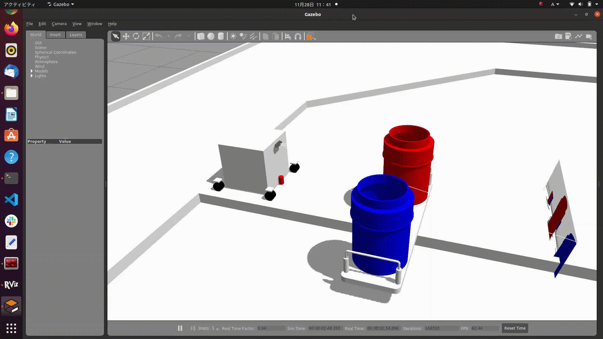

# Gazeboとは

[前のページ](../../rviz/practice)

## Gazeboとは

Gazeboとは，ROSと相性の良い物理シミュレータです．
URDFで記述したロボットモデルをGazebo上にスポーンさせ，ROSトピックを投げることでシミュレーション空間上でロボットを動かすことができます．その他の障害物等も再現することができ，ロボットが実際に動作するフィールドを再現することで実機を動かす前にROSのシステムが正しく動作するかを確認することができます．

## 使用例

この写真では，ロボットやロボットの走行するフィールドが表示されています．このシミュレータでは，ロボットの車輪の回転ジョイントをROSトピックで回し，ロボットは物理法則に従ってフィールド上を移動します．

ロボットとフィールドが接触した際は，物理法則に従って衝突が起こります．上図のシミュレータではフィールドのテーブルが回転するようにしており，衝突による回転も再現できます．

本記事では，前章で作成したURDFをGazeboでシミュレーション可能な形にするために，物理量やアクチュエータ，センサの設定を加えていきます．また，そのようにして得られたロボットモデルをGazebo上にスポーンさせ，実際に動かしてみます．

## リンク

[次のページ](../phisical_quantity/)

[目次](../../)

---

## 余談
上記画像は以下のリポジトリのシミュレータの画像となっています．

https://github.com/KeioRoboticsAssociation/nhk2021_ilias

git cloneしてREADMEに従ってインストールすれば上記画像を各自の環境で再現することができるので，興味のある方は遊んでみてください．
