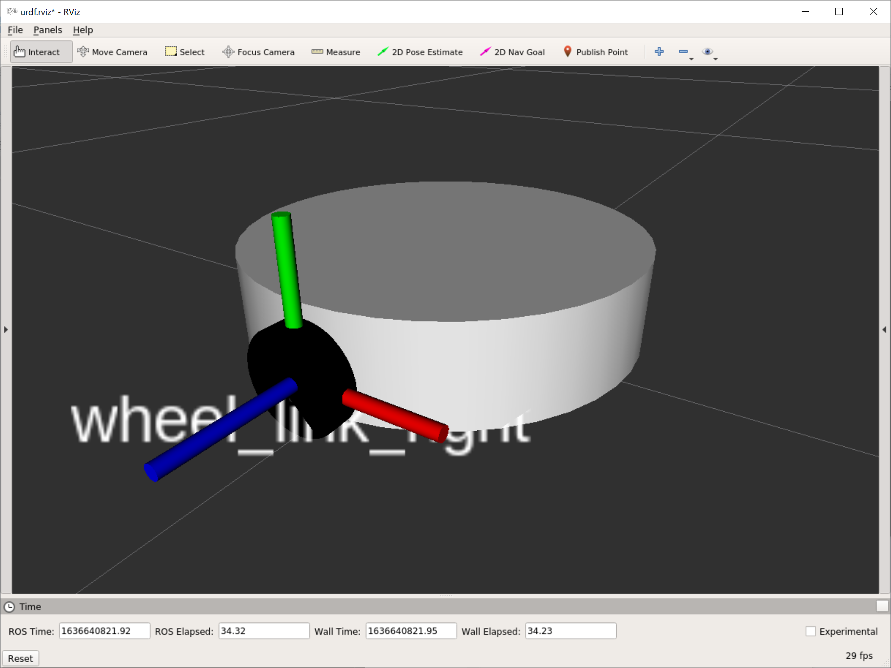

# URDFに物理量を追加

[前のページ](../about/)

## 概要

前章で作成したroomba.urdfに以下の物理量を追加します．
- リンク
    - 衝突判定に使う形状
    - 慣性モーメント
    - 色（RvizとGazeboで色の表現方法が異なるため）
    - （地面に接地するリンク）摩擦
- （回転）ジョイント
    - 出力最大トルク，速度
    - 減衰係数，摩擦

my_urdf_tutorial/urdfの中に，roomba_sim.urdfというroomba.urdfをコピペしたファイルを用意し，追記していきます．

参考：[Gazebo Tutorial](http://gazebosim.org/tutorials/?tut=ros_urdf)


## リンク
例として，wheel_link_rightに物理量を追記していきます．

全体像
```xml
  <link name="wheel_link_right">
    <visual>
      <geometry>
        <cylinder radius="0.036" length="0.016"/>
      </geometry>
      <origin xyz="0 0 0" rpy="0 0 0"/>
      <material name="black">
        <color rgba="0.0 0.0 0.0 2.0"/>
      </material>
    </visual>
    <collision>
      <geometry>
        <cylinder radius="0.036" length="0.016"/>
      </geometry>
      <origin xyz="0 0 0" rpy="0 0 0"/>
    </collision>
    <inertial>
        <origin xyz="0 0 0" rpy="0 0 0" />
        <mass value="0.1" />
        <inertia ixx="0.000034533333" 
            ixy="0"  ixz="0"
            iyx="0"  iyy="0.000034533333" 
            iyz="0"
            izx="0"  izy="0"  izz="0.0000648" />
    </inertial>
  </link>

  <gazebo reference="wheel_link_right">
    <material>Gazebo/Black</material>
    <mu1 value="1.0" />
    <mu2 value="1.0" />
  </gazebo>
```

### 衝突判定に使う形状
#### `<collision>`タグ

```xml
<collision>
    <geometry>
        <cylinder radius="0.036" length="0.016"/>
    </geometry>
    <origin xyz="0 0 0" rpy="0 0 0"/>
</collision>
```
- collision：衝突判定に関する記述
    - geometry：基本図形の形状
    - origin：リンク座標系から見たリンクの重心の位置

urdfのvisualと全く同じ文法なので，詳細は割愛します．

visualとcollisionは基本的には同じ寸法でよいですが，見た目より衝突判定を緩くしたい場合はcollisionの寸法を少し小さく書いたりします．

今回は同じ寸法で記述します．

### 慣性モーメント

```xml
<inertial>
    <origin xyz="0 0 0" rpy="0 0 0" />
    <mass value="0.1" />
    <inertia ixx="0.000034533333" 
        ixy="0"  ixz="0"
        iyx="0"  iyy="0.000034533333" 
        iyz="0"
        izx="0"  izy="0"  izz="0.0000648" />
</inertial>
```

- inertial：質量と慣性を定義
    - origin：リンク座標系から見た重心位置
    - mass：リンクの質量
    - inertia：リンクの重心周りの慣性モーメント

originについては0でよいでしょう．

massについては，今回は車輪の質量を0.1kgとします．

問題はinertiaで，これは慣性モーメントテンソルを表しています．ここは剛体の物理学を用いて計算します．詳細は余談をご覧ください．
今回は密度は一様であると仮定して計算します．



今回は車輪に対して上図のようにxyz軸が重心に位置しています．赤がx, 緑がy, 青がzです．(RGBとxyzの順番が一致していると覚えましょう)

よって，xyz周りの慣性モーメントはそれぞれ以下の式で求められます．なお，$M$は質量，$R$は半径，$h$は高さです.


- x軸周り

    $I_{xx}=M\left(\dfrac{R^2}{4}+ \dfrac{h^2}{12} \right)$

- y軸周り

    $I_{yy}=M\left(\dfrac{R^2}{4}+ \dfrac{h^2}{12} \right)$
    
- z軸周り

    $I_{zz}=\dfrac{1}{2}MR^2$
    

参考：[剛体の慣性モーメントの計算](https://physics-school.com/moment-of-inertia/)

今回，$M=0.1$, $R=0.036$, $h=0.016$なので，上式に代入することでinertiaの項目を埋めることができます.

### 色
```xml
<gazebo reference="wheel_link_right">
    <material>Gazebo/Black</material>
</gazebo>
```
これ以降は新たに`<gazebo>`タグを用いて記述していきます．Gazebo特有の記法だからです．`<gazebo reference="リンクの名前">`というようにします．

まず，色の描画がGazeboとRvizで異なるので，上記のようにGazebo用に再度色についての記述を行います．
黒なら`Gazebo/Black`，白なら`Gazebo/White`のように書きます．

### 摩擦
```xml
<gazebo reference="wheel_link_right">
    <mu1 value="1.0" />
    <mu2 value="1.0" />
</gazebo>
```

地面に接地するリンクには摩擦係数についての設定をします．mu1, mu2は[ODE (Open Dynamics Engine) で定義されているクーロン摩擦モデル](http://www.ode.org/ode-latest-userguide.html#sec_7_3_7)と同様の意味です．基本的にはmu1=mu2で問題ありません．車輪の摩擦係数は[こちら](https://github.com/qboticslabs/mastering_ros_robot_description_pkg/blob/master/urdf/wheel.urdf.xacro#L42-L43)と同様に適当に1.0としています．

なお．色と摩擦はともにgazeboタグの傘下なので，ひとまとめにして以下のように書くこともできます．

```xml
<gazebo reference="wheel_link_right">
    <material>Gazebo/Black</material>
    <mu1 value="1.0" />
    <mu2 value="1.0" />
</gazebo>
```

## ジョイント
例として，wheel_joint_rightに物理量を追記していきます．以下の追加は回転ジョイントにのみ行えばよいです．

全体像

```xml
  <joint name="wheel_joint_right" type="continuous">
    <parent link="body_link"/>
    <child  link="wheel_link_right"/>
    <origin xyz="0 -0.158 -0.01" rpy="1.570796326794897 0 0" />
    <axis xyz="0 0 -1" />
    <limit effort="10" velocity="10" />
    <joint_properties damping="0.1" friction="0.0" />
  </joint>
```

### 出力最大トルク，速度
`<limit effort="出力最大トルク[N･m]" velocity="出力最大速度[m/s]" />`

今回は適当にそれぞれ10と設定しています．

### 減衰係数，摩擦
`<joint_properties damping="減衰係数[N･m･s/rad]" friction="摩擦係数" />`

今回は適当に粘性係数を0.1, 摩擦係数を0にしています．

## 全体像
以上の物理量を他のリンク，ジョイントにも追加すると以下のようになります．
なお．各リンクの物理量は以下の通りとします．余力のある方は自身で書いてみてください．

### body_link
- 半径0.15m, 高さ0.072mの円柱
- 質量3.0kg
- 白色

### ball_link_front, ball_link_back
- 半径0.01mの球
- 質量0.05kg
- 摩擦係数0.1
- 白色

なお，慣性モーメントはxyz軸のどの軸中心で回しても以下の値となります．ただし，$M=0.05, R=0.01$です．

$I=\dfrac{2}{5}MR^2$

### wheel_link_right, wheel_link_left
- 半径0.036m, 高さ0.016mの円柱
- 質量0.1kg
- 摩擦係数1.0
- 黒色

### wheel_joint_right, wheel_joint_left
- 出力最大トルク10 N･m，速度10 m/s
- 減衰係数0.1 N･m･s/rad，摩擦係数0.0

```xml
<robot name="roomba">

  <link name="base_link"/>

  <link name="body_link">
    <visual>
      <geometry>
        <cylinder radius="0.15" length="0.072"/>
      </geometry>
      <origin xyz="0 0 0" rpy="0 0 0"/>
      <material name="white">
        <color rgba="1.0 1.0 1.0 2.0"/>
      </material>
    </visual>
    <collision>
      <geometry>
        <cylinder radius="0.15" length="0.072"/>
      </geometry>
      <origin xyz="0 0 0" rpy="0 0 0"/>
    </collision>
    <inertial>
        <origin xyz="0 0 0" rpy="0 0 0" />
        <mass value="3.0" />
        <inertia ixx="0.018171" 
            ixy="0"  ixz="0"
            iyx="0"  iyy="0.018171" 
            iyz="0"
            izx="0"  izy="0"  izz="0.03375" />
    </inertial>
  </link>

  <gazebo reference="body_link">
    <material>Gazebo/White</material>
    <mu1 value="1.0" />
    <mu2 value="1.0" />
  </gazebo>

  <link name="ball_link_front">
    <visual>
      <geometry>
        <sphere radius="0.01"/>
      </geometry>
      <origin xyz="0 0 0" rpy="0 0 0"/>
      <material name="white">
        <color rgba="1.0 1.0 1.0 2.0"/>
      </material>
    </visual>
    <collision>
      <geometry>
        <sphere radius="0.01"/>
      </geometry>
      <origin xyz="0 0 0" rpy="0 0 0"/>
    </collision>
    <inertial>
        <origin xyz="0 0 0" rpy="0 0 0" />
        <mass value="0.05" />
        <inertia ixx="0.000002" 
            ixy="0"  ixz="0"
            iyx="0"  iyy="0.000002" 
            iyz="0"
            izx="0"  izy="0"  izz="0.000002" />
    </inertial>
  </link>

  <gazebo reference="ball_link_front">
    <material>Gazebo/White</material>
    <mu1 value="0.1" />
    <mu2 value="0.1" />
  </gazebo>

  <link name="ball_link_back">
    <visual>
      <geometry>
        <sphere radius="0.01"/>
      </geometry>
      <origin xyz="0 0 0" rpy="0 0 0"/>
      <material name="white">
        <color rgba="1.0 1.0 1.0 2.0"/>
      </material>
    </visual>
    <collision>
      <geometry>
        <sphere radius="0.01"/>
      </geometry>
      <origin xyz="0 0 0" rpy="0 0 0"/>
    </collision>
    <inertial>
        <origin xyz="0 0 0" rpy="0 0 0" />
        <mass value="0.05" />
        <inertia ixx="0.000002" 
            ixy="0"  ixz="0"
            iyx="0"  iyy="0.000002" 
            iyz="0"
            izx="0"  izy="0"  izz="0.000002" />
    </inertial>
  </link>

  <gazebo reference="ball_link_back">
    <material>Gazebo/White</material>
    <mu1 value="0.1" />
    <mu2 value="0.1" />
  </gazebo>

  <link name="wheel_link_right">
    <visual>
      <geometry>
        <cylinder radius="0.036" length="0.016"/>
      </geometry>
      <origin xyz="0 0 0" rpy="0 0 0"/>
      <material name="black">
        <color rgba="0.0 0.0 0.0 2.0"/>
      </material>
    </visual>
    <collision>
      <geometry>
        <cylinder radius="0.036" length="0.016"/>
      </geometry>
      <origin xyz="0 0 0" rpy="0 0 0"/>
    </collision>
    <inertial>
        <origin xyz="0 0 0" rpy="0 0 0" />
        <mass value="0.1" />
        <inertia ixx="0.000034533333" 
            ixy="0"  ixz="0"
            iyx="0"  iyy="0.000034533333" 
            iyz="0"
            izx="0"  izy="0"  izz="0.0000648" />
    </inertial>
  </link>

  <gazebo reference="wheel_link_right">
    <material>Gazebo/Black</material>
    <mu1 value="1.0" />
    <mu2 value="1.0" />
  </gazebo>

  <link name="wheel_link_left">
    <visual>
      <geometry>
        <cylinder radius="0.036" length="0.016"/>
      </geometry>
      <origin xyz="0 0 0" rpy="0 0 0"/>
      <material name="black">
        <color rgba="0.0 0.0 0.0 2.0"/>
      </material>
    </visual>
    <collision>
      <geometry>
        <cylinder radius="0.036" length="0.016"/>
      </geometry>
      <origin xyz="0 0 0" rpy="0 0 0"/>
    </collision>
    <inertial>
        <origin xyz="0 0 0" rpy="0 0 0" />
        <mass value="0.1" />
        <inertia ixx="0.000034533333" 
            ixy="0"  ixz="0"
            iyx="0"  iyy="0.000034533333" 
            iyz="0"
            izx="0"  izy="0"  izz="0.0000648" />
    </inertial>
  </link>

  <gazebo reference="wheel_link_left">
    <material>Gazebo/Black</material>
    <mu1 value="1.0" />
    <mu2 value="1.0" />
  </gazebo>
  
  <joint name="body_joint" type="fixed">
    <parent link="base_link"/>
    <child  link="body_link"/>
    <origin xyz="0 0 0.046" rpy="0 0 0" />
  </joint>

  <joint name="ball_joint_front" type="fixed">
    <parent link="body_link"/>
    <child  link="ball_link_front"/>
    <origin xyz="0.11 0 -0.036" rpy="0 0 0" />
  </joint>

  <joint name="ball_joint_back" type="fixed">
    <parent link="body_link"/>
    <child  link="ball_link_back"/>
    <origin xyz="-0.11 0 -0.036" rpy="0 0 0" />
  </joint>

  <joint name="wheel_joint_right" type="continuous">
    <parent link="body_link"/>
    <child  link="wheel_link_right"/>
    <origin xyz="0 -0.158 -0.01" rpy="1.570796326794897 0 0" />
    <axis xyz="0 0 -1" />
    <limit effort="10" velocity="10" />
    <joint_properties damping="0.1" friction="0.0" />
  </joint>

  <joint name="wheel_joint_left" type="continuous">
    <parent link="body_link"/>
    <child  link="wheel_link_left"/>
    <origin xyz="0 0.158 -0.01" rpy="1.570796326794897 0 0" />
    <axis xyz="0 0 -1" />
    <limit effort="10" velocity="10" />
    <joint_properties damping="0.1" friction="0.0" />
  </joint>

</robot>
```


## リンク

[次のページ](../actuator/)

[目次](../../)


---

## 余談
### 慣性モーメントテンソルについて
慣性モーメントは回転軸に対する物体の回転のしにくさを表しますが，xyzの各座標軸における回転のしにくさを以下のようにひとつの行列で表したものを慣性モーメントテンソルといいます．
このうち，$I_{xx}$はx軸周りの慣性モーメント，$I_{yy}$はy軸周りの慣性モーメント，$I_{zz}$はz軸周りの慣性モーメントになります．非対角成分は慣性乗積といいます．

$I=\left(\begin{array}{c}I_{xx} & I_{xy} & I_{xz}\\ I_{yx} & I_{yy} & I_{yz}\\ I_{zx} & I_{zy} & I_{zz}\end{array}\right)$

ここで，xyz座標軸をうまくとることで，慣性乗積を0にすることができ，以下の形で表すことができます．イメージ的には，例えば今回の車輪のように，xyz軸それぞれに対して物体の形状が対称である場合，各軸に対して"きれいに"回転するので慣性乗積が0になります．（対称な場合，非対角成分が回転の各ステップにおいて相殺されるイメージです）

$I=\left(\begin{array}{c}I_{xx} & 0 & 0\\ 0 & I_{yy} & 0\\ 0 & 0 & I_{zz}\end{array}\right)$

参考リンク
- [剛体の慣性モーメントの計算](https://physics-school.com/moment-of-inertia/)
    - 円柱の各xyz軸における慣性モーメントの求め方や，慣性モーメントテンソルについても記載されています．
- [20分で分かる慣性テンソル【古典力学_回転の力学】](https://youtu.be/CVUIrfvHemU)
    - 慣性モーメントテンソルの導出からその物理的意味まで分かりやすく説明されています．