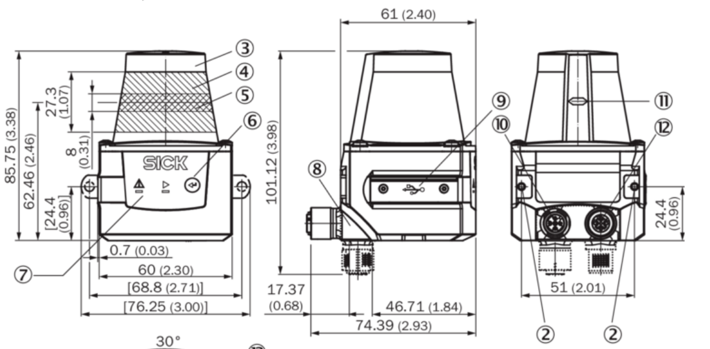
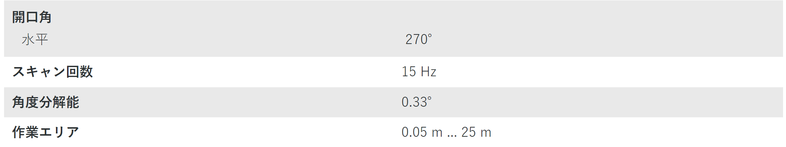
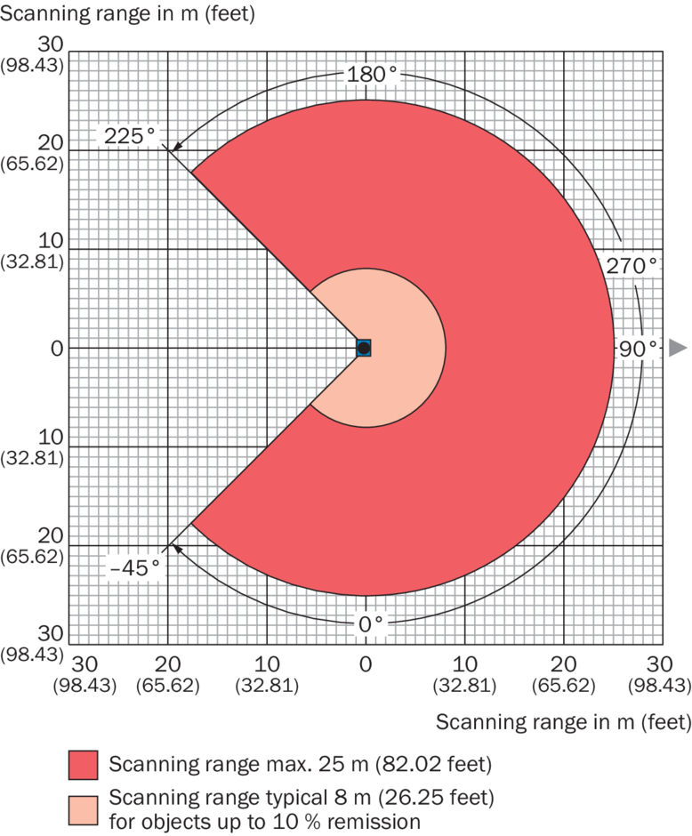
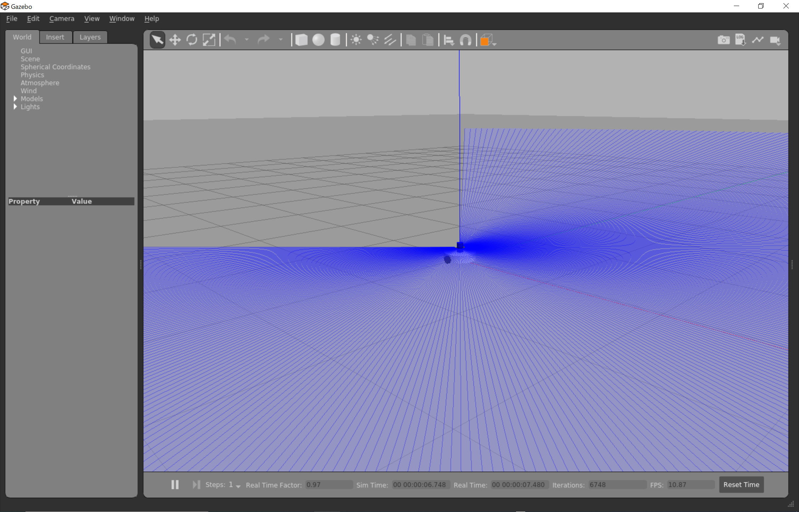
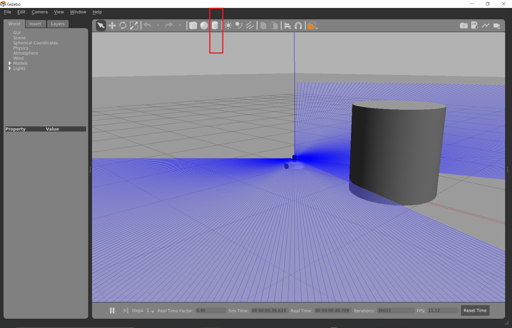
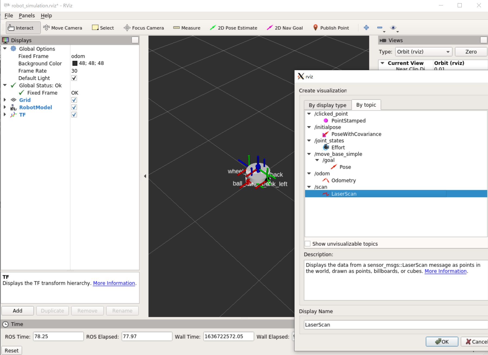
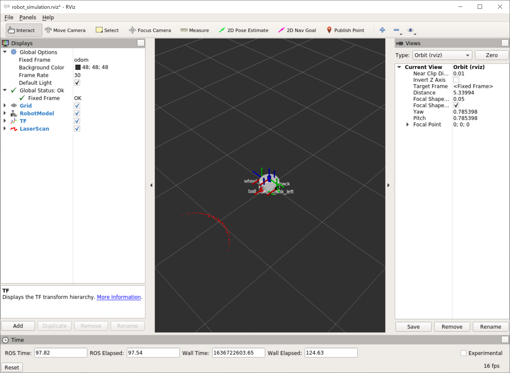

# ロボットモデルにセンサを追加

[前のページ](../spawn/)

## 概要

Gazeboではいくつかのセンサのシミュレーションも可能です．今回はロボットモデルに2D LiDARセンサを追加します．

## LiDARとは
LiDAR (Light Detection and Ranging) は周囲の障害物までの距離を計測できるセンサです．LRF (Laser Range Finder) やLRS (Laser Range Sensor) などとも呼ばれます．

LiDARと呼ぶことにすれば、2次元平面上の周囲の障害物の距離を計測できるものを2D LiDAR、3次元空間上の周囲の障害物の距離を計測できるものを3D LiDARといいます。

今回は2D LiDARセンサを追加し，ロボット周囲の2次元点群情報を取得できるようにします．

余談の欄によく使用される2D LiDARについて記載しましたが，今回はそのうちSickの2D LiDARをモデリングしていきます．（Sickは慶應に様々な支援をしてくださっているためです笑）

Sickの2D LiDARのうち小型で性能が高く移動ロボットと相性が良いものは[TiM571](https://www.sick.com/jp/ja/detection-and-ranging-solutions/2d-lidar/tim5xx/tim571-9950101s01/p/p456849)なので，今回はこちらの仕様を見ながらパラメータを合わせていきます．

## センサモデルの作成
### リンク
今まで通り，URDFでセンサのリンクを作成します．



|  重量  |  寸法 (長さ x 幅 x 高さ)  |
| ---- | ---- |
| 250 g, 接続ケーブルなし |  60 mm x 60 mm x 86 mm  |

[TiM571](https://www.sick.com/jp/ja/detection-and-ranging-solutions/2d-lidar/tim5xx/tim571-9950101s01/p/p456849)より引用

TiM571の寸法を見て，大まかに半径30mm, 高さ86mmの円柱に見立ることにします．また，重量は0.25kgとします．色は白や黒だと車体や車輪の色と被るため．ここではSickのロゴの色の青にしてみます．

ここまで決めれば，今まで学んだ内容で以下のURDFが記述できると思います．

```xml
  <link name="lidar_link">
    <visual>
      <geometry>
        <cylinder radius="0.030" length="0.086"/>
      </geometry>
      <origin xyz="0 0 0" rpy="0 0 0"/>
      <material name="blue">
        <color rgba="0.0 0.0 1.0 2.0"/>
      </material>
    </visual>
    <collision>
      <geometry>
        <cylinder radius="0.030" length="0.086"/>
      </geometry>
      <origin xyz="0 0 0" rpy="0 0 0"/>
    </collision>
    <inertial>
        <origin xyz="0 0 0" rpy="0 0 0" />
        <mass value="0.25" />
        <inertia ixx="0.00021033333" 
            ixy="0"  ixz="0"
            iyx="0"  iyy="0.00021033333" 
            iyz="0"
            izx="0"  izy="0"  izz="0.0001125" />
    </inertial>
  </link>

  <gazebo reference="lidar_link">
    <material>Gazebo/Blue</material>
  </gazebo>
```

### ジョイント
今回は，ルンバの車体のど真ん中にLiDARを設置してみましょう．body_linkの円柱の高さが72mm, LiDARの円柱の高さが86mmなので，body_linkの重心から真上に72/2+86/2=79mmのところにlidar_linkの重心が来ます．よって以下のようにジョイントを記述します．

```xml
  <joint name="lidar_joint" type="fixed">
    <parent link="body_link"/>
    <child  link="lidar_link"/>
    <origin xyz="0 0 0.079" rpy="0 0 0" />
  </joint>
```

## GazeboのLaserプラグイン
ここで，GazeboのLaserプラグインを用いることでLiDARをシミュレーションします．以下のように書きます．なお，`<gazebo>`タグでの記述なので，先程書いた色の情報も一緒に含めました．

```xml
  <gazebo reference="lidar_link">
    <material>Gazebo/Blue</material>
    <sensor type="ray" name="lidar">
      <pose>0 0 0 0 0 0</pose>
      <visualize>true</visualize>
      <update_rate>15</update_rate>
      <ray>
        <scan>
          <horizontal>
            <samples>400</samples>
            <resolution>1</resolution>
            <min_angle>-2.35619449</min_angle>
            <max_angle>2.35619449</max_angle>
          </horizontal>
        </scan>
        <range>
          <min>0.05</min>
          <max>25.0</max>
          <resolution>0.001</resolution>
        </range>
        <noise>
          <type>gaussian</type>
          <mean>0.0</mean>
          <stddev>0.01</stddev>
        </noise>
      </ray>
      <plugin name="gazebo_ros_lidar_controller" filename="libgazebo_ros_laser.so">
        <topicName>scan</topicName>
        <frameName>lidar_link</frameName>
      </plugin>
    </sensor>
  </gazebo>
```

以下にパラメータの説明を記載します．重要なものは黒字にしました．それ以外はそういうものかと思ってくだされば結構です．

- gazebo：リンク名を書いてgazeboの内容と紐づける
    - material：すでに説明した通り，色
    - sensor：センサの種類
        - pose：A position(x,y,z) and orientation(roll, pitch yaw) with respect to the specified frame.（原文ママ．こう書いてますが，ここを変化させても光源の位置が変化しなくてよくわかりません，，今回は他の記事と同様に0にします）
        - visualize：Gazebo上でLaser光線を可視化するか否か．確認のためはじめはtrueにしておきます．
        - **update_rate**：センサの情報をpublishする周波数
        - ray
            - scan
                - **horizontal**：水平方向のLiDARの設定．3D LiDARの場合はverticalも記載する．
                    - samples：一周で何ポイント分取得するか．
                    - resolution：sample*resolutionが一周で何ポイント分取得するかの値らしい（[コード](https://github.com/osrf/gazebo/blob/gazebo11/gazebo/sensors/RaySensor.cc#L218-L219)）．基本はresolutionは1
                    - min_angle：前方を0 radとして，最小何radまで検出できるか
                    - max_angle：前方を0 radとして，最大何radまで検出できるか
            - **range**
                - min：検出できる最小距離 (m)
                - max：検出できる最大距離 (m)
                - resolution：分解能(m)です．ただ，どの値にしても分解能は変わらず非常に細かく（小数点以下16桁）出るのでよくわかりません．今回はとりあえず0.001にします．
            - noise
                - type：ノイズの種類
                - mean：ノイズの平均値
                - std_dev：ノイズの分散値
        - plugin
            - **topicName**：publishされるセンサデータのROSトピック名
            - **frameName**：センサデータと紐づけるframe名（リンク名）

参考：[SDFormat](http://sdformat.org/spec?ver=1.6&elem=sensor#sensor_ray)

上記のパラメータを，実際のLiDARの仕様に合わせて変更します．





角度は-135度から135度とし，ラジアン変換してパラメータを変更します．また，update_rateは15Hzとします．samplesは270/0.33≒818と計算できますが，今回は計算負荷削減のために400とします．

また，rangeのminは0.05m, maxは25mとします．

以上をすべて合わせると以下のようなurdfになります．

```xml
<robot name="roomba_sim">

  <link name="base_link"/>

  <link name="body_link">
    <visual>
      <geometry>
        <cylinder radius="0.15" length="0.072"/>
      </geometry>
      <origin xyz="0 0 0" rpy="0 0 0"/>
      <material name="white">
        <color rgba="1.0 1.0 1.0 2.0"/>
      </material>
    </visual>
    <collision>
      <geometry>
        <cylinder radius="0.15" length="0.072"/>
      </geometry>
      <origin xyz="0 0 0" rpy="0 0 0"/>
    </collision>
    <inertial>
        <origin xyz="0 0 0" rpy="0 0 0" />
        <mass value="3.0" />
        <inertia ixx="0.018171" 
            ixy="0"  ixz="0"
            iyx="0"  iyy="0.018171" 
            iyz="0"
            izx="0"  izy="0"  izz="0.03375" />
    </inertial>
  </link>

  <gazebo reference="body_link">
    <material>Gazebo/White</material>
  </gazebo>

  <link name="ball_link_front">
    <visual>
      <geometry>
        <sphere radius="0.01"/>
      </geometry>
      <origin xyz="0 0 0" rpy="0 0 0"/>
      <material name="white">
        <color rgba="1.0 1.0 1.0 2.0"/>
      </material>
    </visual>
    <collision>
      <geometry>
        <sphere radius="0.01"/>
      </geometry>
      <origin xyz="0 0 0" rpy="0 0 0"/>
    </collision>
    <inertial>
        <origin xyz="0 0 0" rpy="0 0 0" />
        <mass value="0.05" />
        <inertia ixx="0.000002" 
            ixy="0"  ixz="0"
            iyx="0"  iyy="0.000002" 
            iyz="0"
            izx="0"  izy="0"  izz="0.000002" />
    </inertial>
  </link>

  <gazebo reference="ball_link_front">
    <material>Gazebo/White</material>
    <mu1 value="0.1" />
    <mu2 value="0.1" />
  </gazebo>

  <link name="ball_link_back">
    <visual>
      <geometry>
        <sphere radius="0.01"/>
      </geometry>
      <origin xyz="0 0 0" rpy="0 0 0"/>
      <material name="white">
        <color rgba="1.0 1.0 1.0 2.0"/>
      </material>
    </visual>
    <collision>
      <geometry>
        <sphere radius="0.01"/>
      </geometry>
      <origin xyz="0 0 0" rpy="0 0 0"/>
    </collision>
    <inertial>
        <origin xyz="0 0 0" rpy="0 0 0" />
        <mass value="0.05" />
        <inertia ixx="0.000002" 
            ixy="0"  ixz="0"
            iyx="0"  iyy="0.000002" 
            iyz="0"
            izx="0"  izy="0"  izz="0.000002" />
    </inertial>
  </link>

  <gazebo reference="ball_link_back">
    <material>Gazebo/White</material>
    <mu1 value="0.1" />
    <mu2 value="0.1" />
  </gazebo>

  <link name="wheel_link_right">
    <visual>
      <geometry>
        <cylinder radius="0.036" length="0.016"/>
      </geometry>
      <origin xyz="0 0 0" rpy="0 0 0"/>
      <material name="black">
        <color rgba="0.0 0.0 0.0 2.0"/>
      </material>
    </visual>
    <collision>
      <geometry>
        <cylinder radius="0.036" length="0.016"/>
      </geometry>
      <origin xyz="0 0 0" rpy="0 0 0"/>
    </collision>
    <inertial>
        <origin xyz="0 0 0" rpy="0 0 0" />
        <mass value="0.1" />
        <inertia ixx="0.000034533333" 
            ixy="0"  ixz="0"
            iyx="0"  iyy="0.000034533333" 
            iyz="0"
            izx="0"  izy="0"  izz="0.0000648" />
    </inertial>
  </link>

  <gazebo reference="wheel_link_right">
    <material>Gazebo/Black</material>
    <mu1 value="1.0" />
    <mu2 value="1.0" />
  </gazebo>

  <link name="wheel_link_left">
    <visual>
      <geometry>
        <cylinder radius="0.036" length="0.016"/>
      </geometry>
      <origin xyz="0 0 0" rpy="0 0 0"/>
      <material name="black">
        <color rgba="0.0 0.0 0.0 2.0"/>
      </material>
    </visual>
    <collision>
      <geometry>
        <cylinder radius="0.036" length="0.016"/>
      </geometry>
      <origin xyz="0 0 0" rpy="0 0 0"/>
    </collision>
    <inertial>
        <origin xyz="0 0 0" rpy="0 0 0" />
        <mass value="0.1" />
        <inertia ixx="0.000034533333" 
            ixy="0"  ixz="0"
            iyx="0"  iyy="0.000034533333" 
            iyz="0"
            izx="0"  izy="0"  izz="0.0000648" />
    </inertial>
  </link>

  <gazebo reference="wheel_link_left">
    <material>Gazebo/Black</material>
    <mu1 value="1.0" />
    <mu2 value="1.0" />
  </gazebo>
  
  <joint name="body_joint" type="fixed">
    <parent link="base_link"/>
    <child  link="body_link"/>
    <origin xyz="0 0 0.046" rpy="0 0 0" />
  </joint>

  <joint name="ball_joint_front" type="fixed">
    <parent link="body_link"/>
    <child  link="ball_link_front"/>
    <origin xyz="0.11 0 -0.036" rpy="0 0 0" />
  </joint>

  <joint name="ball_joint_back" type="fixed">
    <parent link="body_link"/>
    <child  link="ball_link_back"/>
    <origin xyz="-0.11 0 -0.036" rpy="0 0 0" />
  </joint>

  <joint name="wheel_joint_right" type="continuous">
    <parent link="body_link"/>
    <child  link="wheel_link_right"/>
    <origin xyz="0 -0.158 -0.01" rpy="1.570796326794897 0 0" />
    <axis xyz="0 0 -1" />
    <limit effort="10" velocity="10" />
    <joint_properties damping="0.0" friction="0.0" />
  </joint>

  <joint name="wheel_joint_left" type="continuous">
    <parent link="body_link"/>
    <child  link="wheel_link_left"/>
    <origin xyz="0 0.158 -0.01" rpy="1.570796326794897 0 0" />
    <axis xyz="0 0 -1" />
    <limit effort="10" velocity="10" />
    <joint_properties damping="0.0" friction="0.0" />
  </joint>

  <gazebo>
    <plugin name="differential_drive_controller" filename="libgazebo_ros_diff_drive.so">

      <!-- Plugin update rate in Hz, defaults to 100 Hz -->
      <updateRate>30</updateRate>

      <!-- Name of left joint, defaults to `left_joint` -->
      <leftJoint>wheel_joint_left</leftJoint>

      <!-- Name of right joint, defaults to `right_joint` -->
      <rightJoint>wheel_joint_right</rightJoint>

      <!-- The distance from the center of one wheel to the other, in meters, defaults to 0.34 m -->
      <wheelSeparation>0.332</wheelSeparation>

      <!-- Diameter of the wheels, in meters, defaults to 0.15 m -->
      <wheelDiameter>0.072</wheelDiameter>

      <!-- Wheel acceleration, in rad/s^2, defaults to 0.0 rad/s^2 -->
      <wheelAcceleration>1.0</wheelAcceleration>

      <!-- Maximum torque which the wheels can produce, in Nm, defaults to 5 Nm -->
      <wheelTorque>10</wheelTorque>

      <!-- Topic to receive geometry_msgs/Twist message commands, defaults to `cmd_vel` -->
      <commandTopic>cmd_vel</commandTopic>

      <!-- Topic to publish nav_msgs/Odometry messages, defaults to `odom` -->
      <odometryTopic>odom</odometryTopic>

      <!-- Odometry frame, defaults to `odom` -->
      <odometryFrame>odom</odometryFrame>

      <!-- Robot frame to calculate odometry from, defaults to `base_footprint` -->
      <robotBaseFrame>base_link</robotBaseFrame>

      <!-- Odometry source, encoder or world, defaults to world -->
      <odometrySource>world</odometrySource>

      <!-- Set to 1 to create odom publisher, defaults to 1 -->
      <publishTf>1</publishTf>

      <!-- Set to true to publish transforms for the wheel links, defaults to false -->
      <publishWheelTF>true</publishWheelTF>

      <!-- Set to true to publish transforms for the odometry, defaults to true -->
      <publishOdomTF>true</publishOdomTF>

      <!-- Set to true to publish sensor_msgs/JointState on /joint_states for the wheel joints, defaults to false -->
      <publishWheelJointState>true</publishWheelJointState>

      <!-- Set to true to swap right and left wheels, defaults to true -->
      <legacyMode>false</legacyMode>

      <!-- DebugMode or not, na or Debug, defaults to na -->
      <rosDebugLevel>na</rosDebugLevel>
    </plugin>
  </gazebo>

  <link name="lidar_link">
    <visual>
      <geometry>
        <cylinder radius="0.030" length="0.086"/>
      </geometry>
      <origin xyz="0 0 0" rpy="0 0 0"/>
      <material name="blue">
        <color rgba="0.0 0.0 1.0 2.0"/>
      </material>
    </visual>
    <collision>
      <geometry>
        <cylinder radius="0.030" length="0.086"/>
      </geometry>
      <origin xyz="0 0 0" rpy="0 0 0"/>
    </collision>
    <inertial>
        <origin xyz="0 0 0" rpy="0 0 0" />
        <mass value="0.25" />
        <inertia ixx="0.00021033333" 
            ixy="0"  ixz="0"
            iyx="0"  iyy="0.00021033333" 
            iyz="0"
            izx="0"  izy="0"  izz="0.0001125" />
    </inertial>
  </link>

  <joint name="lidar_joint" type="fixed">
    <parent link="body_link"/>
    <child  link="lidar_link"/>
    <origin xyz="0 0 0.079" rpy="0 0 0" />
  </joint>

  <gazebo reference="lidar_link">
    <material>Gazebo/Blue</material>
    <sensor type="ray" name="lidar">
      <pose>0 0 0 0 0 0</pose>
      <visualize>true</visualize>
      <update_rate>15</update_rate>
      <ray>
        <scan>
          <horizontal>
            <samples>400</samples>
            <resolution>1</resolution>
            <min_angle>-2.35619449</min_angle>
            <max_angle>2.35619449</max_angle>
          </horizontal>
        </scan>
        <range>
          <min>0.05</min>
          <max>25.0</max>
          <resolution>0.001</resolution>
        </range>
        <noise>
          <type>gaussian</type>
          <mean>0.0</mean>
          <stddev>0.01</stddev>
        </noise>
      </ray>
      <plugin name="gazebo_ros_lidar_controller" filename="libgazebo_ros_laser.so">
        <topicName>scan</topicName>
        <frameName>lidar_link</frameName>
      </plugin>
    </sensor>
  </gazebo>

</robot>
```

## 動作確認

```bash
roslaunch my_urdf_tutorial robot_simulation.launch
```

### Gazebo
以下のように表示されればOKです．ちゃんと270度分レーザーが出ていますね．



ここで，以下の図で赤四角で囲った部分をクリックすると円柱を障害物として登場させることができます．実際に表示させてみましょう．しっかりレーザーがさえぎられることがわかります．



### Rviz
2D LiDARが取得したデータがscanという名前のROSトピックでpublishされているので，確認してみましょう．Addを押して，By topicタブを選択し，以下の図のように/scanのLaserScanをクリックしてOKを押します．



すると以下のように障害物の位置が赤い点群で表示されます！せっかくなので，ここでCtrl+Sを押してこのRvis configを上書き保存しましょう．



## おわりに

ここまでで，2D LiDARを積んだ移動ロボットのシミュレーションモデルを作成することができました．次章では，2D LiDARで取得した周囲の環境情報に応じて移動する知能ロボットのコード作成をROSを用いて行います！

## リンク

[次のページ](../../)

[目次](../../)


---

## 余談
### Gazeboでシミュレーションできるセンサ例
RGBD Camera, IMU, Laser sensor (1D, 2D, 3D LiDAR), etc...
### 2D LiDAR
北陽電機，Sick, RPLiDAR, YDLiDAR, etc...

### 3D LiDAR
Velodyne, Robosense, 北陽, Sick, etc...