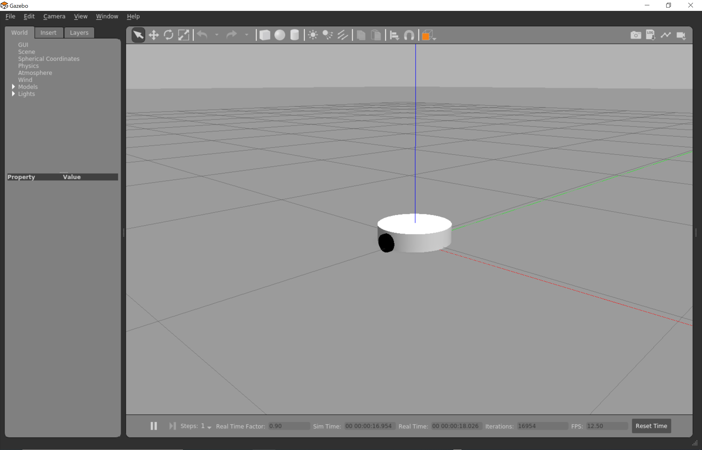
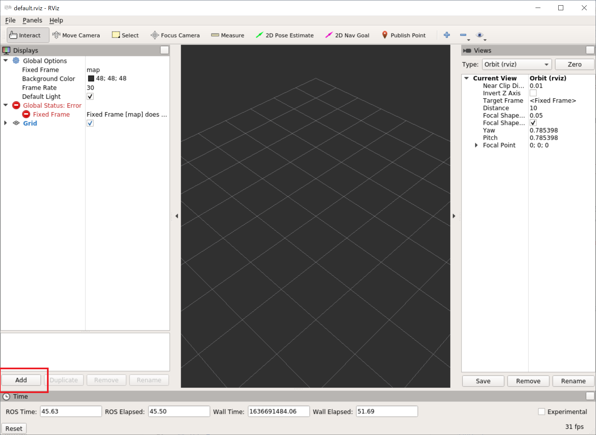
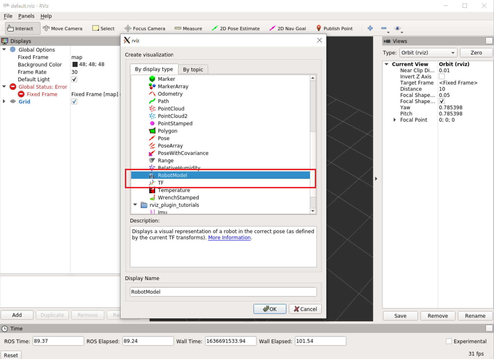
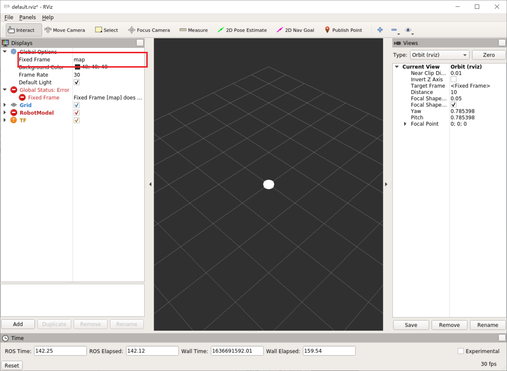
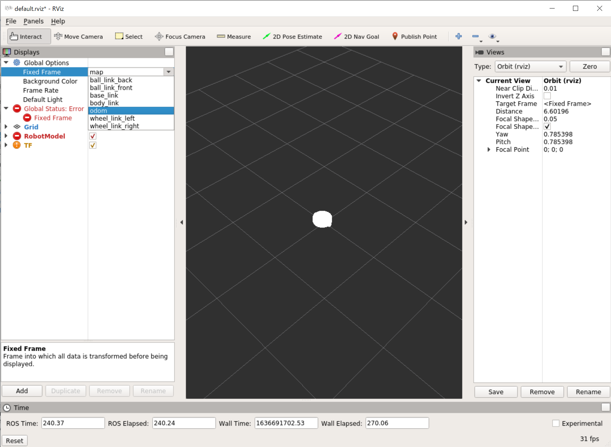
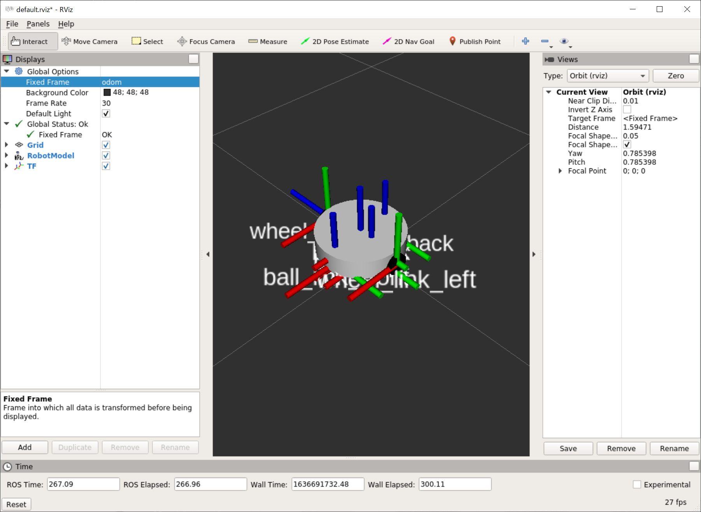
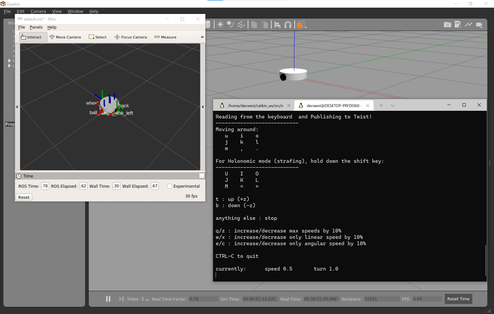
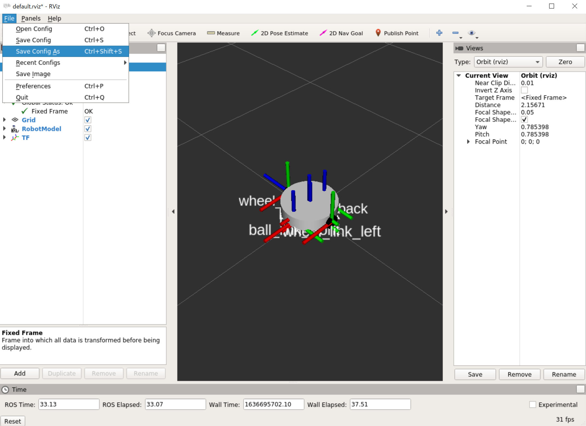
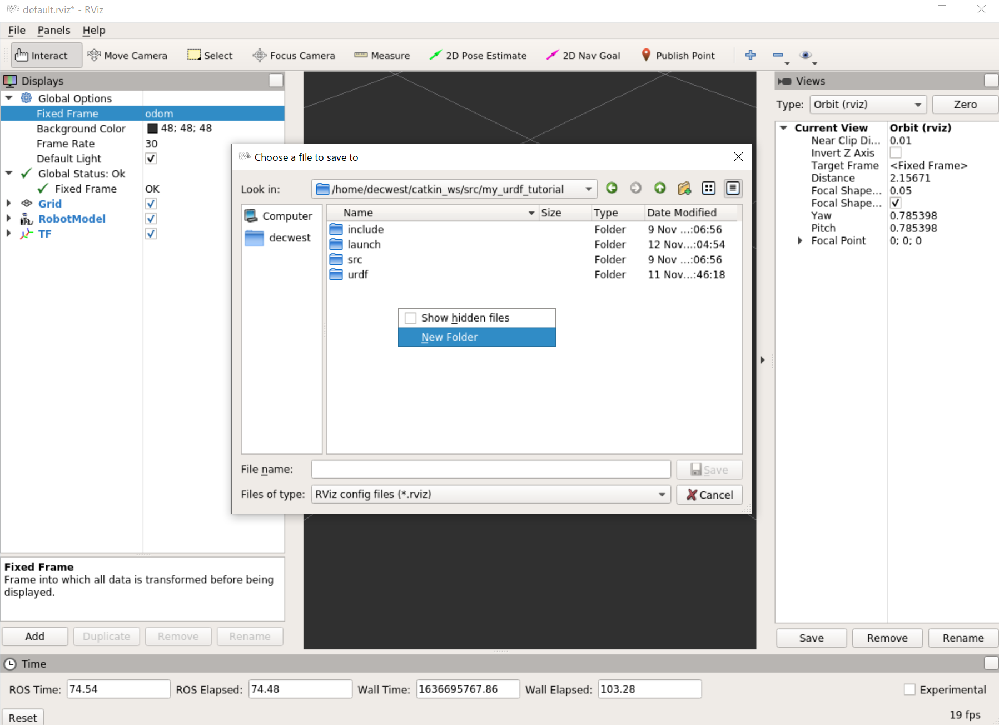
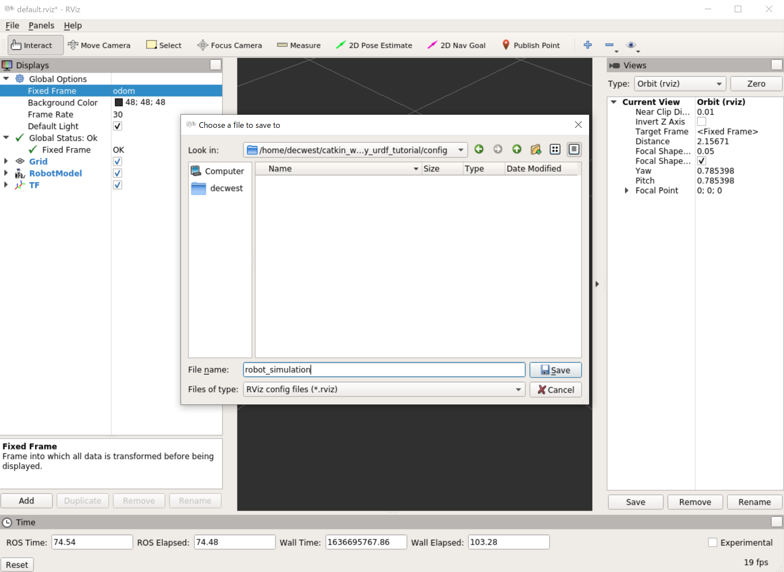

# Gazebo上にロボットをスポーン

[前のページ](../actuator/)

## 概要

Gazebo上にロボットをスポーンさせるlaunchファイルを書きます．

## launchファイル作成

my_urdf_tutorial配下にlaunchディレクトリを作成し，robot_simulation.launchという名前のlaunchファイルを作成します．

```xml
<?xml version="1.0"?>
<launch>
  <param name="robot_description" textfile="$(find my_urdf_tutorial)/urdf/roomba_sim.urdf"/>

  <include file="$(find gazebo_ros)/launch/empty_world.launch"/>

  <node name="spawn_urdf" pkg="gazebo_ros" type="spawn_model" args="-param robot_description -x 0.0 -y 0.0 -z 0.5 -R 0 -P 0 -Y 0 -urdf -model roomba_sim" />

  <node name="robot_state_publisher" pkg="robot_state_publisher" type="robot_state_publisher" output="screen" />
  
  <node name="rviz" pkg="rviz" type="rviz"/>

</launch>
```

### 各行解説
```xml
  <param name="robot_description" textfile="$(find my_urdf_tutorial)/urdf/roomba_sim.urdf"/>
```
urdfをrobot_descriptionという名前のROSのパラメータとして読み込んでいます．`"$(find my_urdf_tutorial)/urdf/roomba_sim.urdf"`でurdfの在処を示しています．
なお，Rvizはロボットモデルをrobot_descriptionという名前のパラメータから読み込むよう指定されているので，ここの名前はrobot_descriptionである必要があります．

```xml
  <include file="$(find gazebo_ros)/launch/empty_world.launch"/>
```
Gazeboを起動するlaunchファイルを含めています．このlaunchファイルは何もない環境を起動します．

```xml
  <node name="spawn_urdf" pkg="gazebo_ros" type="spawn_model" args="-param robot_description -x 0.0 -y 0.0 -z 0.5 -R 0 -P 0 -Y 0 -urdf -model roomba_sim" />
```
urdfで作成したロボットモデルをGazeboにスポーンさせます．
xyzRPYはスポーンさせる座標で，車輪が地面にめり込むのを防ぐためにz=0.5の上空から降らせています．modelには自身で作成したurdfのrobotタグで指定した名前を記載します．

```xml
  <node name="robot_state_publisher" pkg="robot_state_publisher" type="robot_state_publisher" output="screen" />
```
Gazebo上のロボットの各リンクの状態をpublishするノードを立ち上げています．これをRvizが受け取ることで，Rviz上のロボットもGazebo上と同様に動きます．

```xml
  <node name="rviz" pkg="rviz" type="rviz"/>
```
Rvizを起動する記述です．

## launch
```bash
roslaunch my_urdf_tutorial robot_simulation.launch
```
- Gazebo

    以下のように表示されれば成功です．

    

- Rviz

    以下のように表示されればひとまずokです．ロボットモデルが表示されていませんが，これはデフォルトの状態ではロボットモデルを表示するようになっていないからです．以下の画像のように，左下のaddを押してロボットモデル等を追加しましょう．

    

    ポップアップウィンドウが出てくるので，RobotModelとTFを選択しましょう．RobotModelはロボットモデル，TFは座標系を管理しているもので，これを追加すると各リンクの座標系を可視化できます．

    

    それっぽい形は表示されましたが，白くなっています．これは，以下の図でmapとなっているところが原因です．Rvizはデフォルトでmapという名前の座標系から見たロボットの様子を可視化するようになっていますが，今の環境にはmap座標系は存在しないからです．

    

    mapの部分をクリックすると以下のようにカーソルが表示されます．見知った座標系（リンク名）が出てきましたね．ここで，**odom**を選択しましょう．こんな名前のリンクは無かったと思いますが，このodom座標系は先程追記したdifferential_drive_controllerプラグインが発行しています．odomはodometryの略で，odometryについては余談をご覧ください．このodom座標系は，ロボットのスタート位置を原点とし，ロボットが移動するとodom座標系から見たbase_linkの位置を変化させるようにdifferential_drive_controllerプラグインが座標系を発行しています．すなわち，odom座標系からロボットを見ることでRviz上でもGazeboと同じようにロボットが動きます．Gazeboは本当に車輪が回転して動いている物理シミュレータですが，Rvizは動く座標系にロボットモデルを肉付けしているだけの可視化ツールという感覚を持つとよいでしょう．

    

    以下のように表示されればokです！

    

    ここでいったんCtrl+Cで閉じましょう．

## ロボットを操作してみる
以下のコマンドを打つと，キーボードでgeometry_msgs/Twist型のcmd_velトピックをpublishすることができるようになります．すなわち，キーボードで先程のロボットを動かせるようになります．

```bash
sudo apt install ros-noetic-teleop-twist-keyboard
```

launchを立ち上げます．

```bash
roslaunch my_urdf_tutorial robot_simulation.launch
```
その後，別ターミナルで

```bash
rosrun teleop_twist_keyboard teleop_twist_keyboard.py
```
として先程ダウンロードしたノードをrosrunしましょう．

Rvizは再度上記と同様のカスタマイズを行ってください．ただ，毎回これを行うのは面倒なので，次の章でカスタマイズを保存するRviz configについて説明します．

以下のように環境が整います．
ここで，teleop_twist_keyboard.pyを起動したターミナルをアクティブにした状態で（カーソルを合わせた状態で），表示されているキーコンフィグに従ってキーボードを押してみましょう．例えば，iボタンを押してみましょう．ロボットが動くはずです！




## Rviz config
現在のRvizコンフィグを保存し，以降呼び出すようにします．
FileのSave Config Asをクリック



my_urdf_tutorialパッケージの場所まで移動したら，configという名前の新たなフォルダを作成しましょう．



my_urdf_tutorial/config配下にroboto_simulation.rvizを作成しましょう．以下のようにrobot_simulationと入力してSaveを押せばOKです．



その後Ctrl+Cで閉じます．次はRviz起動時にコンフィグを読み込むようにrobot_simulation.launchを以下のように書き換えます．

```xml
<?xml version="1.0"?>
<launch>
  <param name="robot_description" textfile="$(find my_urdf_tutorial)/urdf/roomba_sim.urdf"/>
  <arg name="rvizconfig" default="$(find my_urdf_tutorial)/config/robot_simulation.rviz" />

  <include file="$(find gazebo_ros)/launch/empty_world.launch"/>

  <node name="spawn_urdf" pkg="gazebo_ros" type="spawn_model" args="-param robot_description -x 0.0 -y 0.0 -z 0.5 -R 0 -P 0 -Y 0 -urdf -model roomba_sim" />

  <node name="robot_state_publisher" pkg="robot_state_publisher" type="robot_state_publisher" output="screen" />
  
  <node name="rviz" pkg="rviz" type="rviz" args="-d $(arg rvizconfig) -f odom"/>
</launch>
```

`  <arg name="rvizconfig" default="$(find my_urdf_tutorial)/config/robot_simulation.rviz" />`を追加し，Rviz起動部分を`  <node name="rviz" pkg="rviz" type="rviz" args="-d $(arg rvizconfig) -f odom"/>`と書き換えました．
rviz configファイルをlaunchの変数として読み込み，Rviz起動時に渡しています．また，Rviz起動時に`-f odom`とすることで座標系 (frame) がmapではなく始めからodomに固定されます．


## リンク

[次のページ](../sensor/)

[目次](../../)


---

## 余談
### odometry（前頁のを再掲）
車輪型移動ロボットにおける車輪の回転角からそれぞれの車輪の移動量を求め、ロボットの位置を推定する手法の総称をオドメトリ (odometry) と言います．
