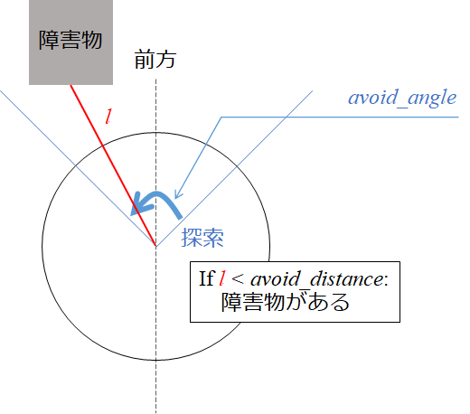

# 演習：部屋を巡回するルンバのROSプログラミング

[前のページ](../gazebo/sensor)

## 概要

今までの章でROSの基礎，2D LiDARを積んだ移動ロボットのシミュレーションモデルの作成を行いました．本章では，2D LiDARで取得した周囲の障害物情報を用いて，障害物にぶつからないように部屋を巡回する知能ロボットのコード作成をROSを用いて行います．

## 問題設定確認
1. 2D LiDARの情報を取得
1. ロボットに速度指令値を与える

[URDFにアクチュエータを追加](../gazebo/actuator/)と[ロボットモデルにセンサを追加](../gazebo/sensor/)で設定した通り，2D LiDARのROSトピック名は`/scan`, 速度指令値のROSトピック名は`/cmd_vel`です．

ここで，これらのトピックの型を調べてみましょう．

```bash
roslaunch my_urdf_tutorial robot_simulation.launch
```

---

問題0：[CommandLine Tools](../ros/command/)の内容を思い出しながら，/scan, /cmd_velの型を調べましょう．

---

解答：`rostopic info /scan`等で以下のようにわかります．

- /scan: sensor_msgs/LaserScan
- /cmd_vel: geometry_msgs/Twist

よって，以下では
- sensor_msgs/LaserScan型のROSトピック/scanをサブスクライブ
- geometry_msgs/Twist型のROSトピック/cmd_velをパブリッシュ

するROSノードを作成しましょう．

## 問題1：上記のpubsubを行うROSノードを作成する
問題1.1: 新たに`room_circuit_controller`という名前のROSパッケージを作成しましょう．

問題1.2: room_circuit_controller.cppを適切な場所に作成し，上記のROSノードを作成しましょう．

設定
- サブスクライブのコールバック関数名は`scanCallback`
- ノード名は`room_circuit_controller`
- コールバック関数の中身はまだ記述しなくて大丈夫です．また，サブスクライブした情報をもとにパブリッシュするため，サブスクライバのコールバック関数内にパブリッシュの記述を書きます．よって，main関数には`while(ros::ok())`ではなく`ros::spin()`を書けばよいです．

参考：[トピック通信実践](../ros/topic/)

解答は[こちら](./answer1/)

## 問題2：/scanの内容に応じて/cmd_velをpublish
/scan, /cmd_velの具体的な内容は以下のリンク先記載の通りです．
ROSトピックの型名でググると出てくるので，ググれるようになりましょう．

[/scan](http://docs.ros.org/en/noetic/api/sensor_msgs/html/msg/LaserScan.html)

[/cmd_vel](http://docs.ros.org/en/melodic/api/geometry_msgs/html/msg/Twist.html)

今回は，以下のような動作フローを考えてみます．
- 2D LiDARの障害物情報をロボット右側から左側に向けて見る
    - 以下の図のようにavoid_angle度分探索する．なお，この領域はロボット前方を軸に左右対称．
- 障害物までの距離がavoid_distanceより小さい場合「障害物がある」とする
    - 前方より右側に「障害物があったら」，速度angular_velocityでその場で反時計回り回転
    - 前方より右側にはないが左側に「障害物があったら」,
    速度angular_velocityでその場で時計回り回転
    - 前方より左側にも右側にもない場合は速度velocityで直進



問題2.1: 以下のソースコードにおける「ここを書く！！！！！」の部分を適切に埋めましょう．

```cpp
#include <ros/ros.h>
#include <geometry_msgs/Twist.h>
#include <sensor_msgs/LaserScan.h>

ros::Publisher pub;
ros::Subscriber sub;

// variables
float velocity = 0.2; // 直進速度
float angular_velocity = 1.57; // 回転速度
float avoid_distance = 1.0; // これ以上近いと障害物とみなす距離
float avoid_angle = 60; // 障害物を探索する範囲

void scanCallback(const sensor_msgs::LaserScan &msg)
{
    int center_index = msg.ranges.size() / 2;             // ロボット前方方向を表すインデックス
    int index_avoid_angle = avoid_angle * (M_PI / 180.0) / msg.angle_increment; // 障害物を探索する範囲に相当するインデックス
    int start_index = center_index - index_avoid_angle / 2; // 探索開始インデックス
    int last_index = center_index + index_avoid_angle / 2; // 探索終了インデックス

    bool detect_obstacle = false;
    std::string detect_side;

    for (int i = start_index; i <= last_index; i++)
    {
        float range = ここを書く！！！！！; // 距離

        // 値が無効な場合の排除
        if (range < msg.range_min || // エラー値の場合
            range > msg.range_max || // 測定範囲外の場合
            std::isnan(range))       // 無限遠の場合
            ;

        // 値が有効である場合
        else
        {
            if (ここを書く！！！！！) // 近くに障害物がある場合
            {
                detect_obstacle = true;
                if (i <= center_index)
                {
                    detect_side = "right";
                }
                else
                {
                    detect_side = "left";
                }
                break;
            }
        }
    }

    geometry_msgs::Twist cmd_vel;

    if (detect_obstacle)
    {
        if (detect_side == "right")
        {
            // その場で反時計回り回転
            cmd_vel.linear.x = 0;
            cmd_vel.angular.z = angular_velocity;
            pub.publish(cmd_vel); // publish
        }
        else
        {
            // その場時計回り回転
            ここを書く！！！！！
        }
    }
    else
    {
        // 直進
        ここを書く！！！！！
    }
}

int main(int argc, char **argv)
{
    ros::init(argc, argv, "room_circuit_controller");
    ros::NodeHandle n;

    pub = n.advertise<geometry_msgs::Twist>("/cmd_vel", 1);
    sub = n.subscribe("/scan", 1, scanCallback);

    ros::spin();
}
```

ヒント：cmd_vel.linear.zに直進速度，cmd_vel.angular.zに回転速度を入れます．

問題2.2: CMakeLists.txtを適切に編集しましょう．

問題2.3: ビルドしましょう．

問題2.4: my_urdf_tutorial/launch/robot_simulation.launchをincludeし，かつroom_circuit_controllerノードを実行するroom_circuit_controller.launchを適切な場所に作成しましょう．


参考

[トピック通信実践](../ros/topic/)

[roslaunch](../ros/roslaunch/)

解答は[こちら](./answer2/)

### 動作確認

```bash
roslaunch room_circuit_controller room_circuit_controller.launch
```

動いたらOKで，さらに前方に障害物を置いてみて障害物回避が行われれば成功です！

また，実際に部屋のような環境で確認したい方は，私の方で部屋のような環境を用意したので以下の手順に従えば導入できます！
1. my_urdf_tutorial配下に`world`ディレクトリを作成
1. worldディレクトリの中に`room.world`という名前のファイルを作成
1. `room.world`に[こちらの内容](https://raw.githubusercontent.com/Decwest/introduction-to-ros/main/practice/world/room.world)をコピペ
1. my_urdf_tutorial/launch/robot_simulation.launchを下記のように変更．gazebo起動時にworldファイルを読み込むように編集します．

    ```xml
    <?xml version="1.0"?>
    <launch>
    <param name="robot_description" textfile="$(find my_urdf_tutorial)/urdf/roomba_sim.urdf"/>
    <arg name="rvizconfig" default="$(find my_urdf_tutorial)/config/robot_simulation.rviz" />

    <include file="$(find gazebo_ros)/launch/empty_world.launch">
        <arg name="world_name" value="$(find my_urdf_tutorial)/world/room.world" />
    </include>

    <node name="spawn_urdf" pkg="gazebo_ros" type="spawn_model" args="-param robot_description -x 0.0 -y 0.0 -z 0.5 -R 0 -P 0 -Y 0 -urdf -model roomba_sim" />

    <node name="robot_state_publisher" pkg="robot_state_publisher" type="robot_state_publisher" output="screen" />
    
    <node name="rviz" pkg="rviz" type="rviz" args="-d $(arg rvizconfig) -f odom"/>
    </launch>
    ```

ここまで行い，

```bash
roslaunch room_circuit_controller room_circuit_controller.launch
```

すると以下のような環境が立ち上がります！（初回起動時はオブジェクトのダウンロードの為少し時間がかかります）

## 問題3
問題3.1: velocity, angular_velocity, avoid_distance, avoid_angleをrosparam化しましょう．

問題3.2: room_circuit_controller.launchからパラメータを渡し，変更できるようにしてみましょう．

参考

[rosparam](../ros/rosparam/)

[roslaunch](../ros/roslaunch/)

解答は[こちら](./answer3/)

ここまでで演習は終了です！完成したら色々とパラメータをいじって遊んでみてください．

## 最後に
### 今回扱えなかったが重要なもの
- [カスタムROSメッセージ](../ros/command/#%E4%BD%99%E8%AB%87)
- [TF](../gazebo/actuator/#%E4%BD%99%E8%AB%87)
- [xacro](../rviz/practice/#%E4%BD%99%E8%AB%87)

リンク先の記事の余談に導入程度の記載をしています．興味のある方は追加で調べてみてください．

### 自律移動ロボット
本記事で自律移動ロボットのシミュレータが作成できたので，本環境を用いてそのまま自律移動ロボットの勉強が可能です．自律移動ロボットの代表的な技術として以下が挙げられます．

- ナビゲーション (autonomous mobile robot navigation)
    - ロボットや自動運転車を，スタートからゴールに向けて誘導する技術です．ただゴールに向かうだけではなく，[障害物回避やロボットの制御性の考慮](https://qiita.com/MENDY/items/16343a00d37d14234437)を始め，[人間との調和性の配慮](https://www.sciencedirect.com/science/article/abs/pii/S0921889013001048)や，[ロボットが実行できるアクションを考慮](https://ieeexplore.ieee.org/abstract/document/9570359)するなど，賢い誘導法の研究が行われています．
- 自己位置推定 (localization)
    - ロボットをスタートからゴールに向けて誘導する際，自分が今どこにいるのかを推定する自己位置推定が必要です．以前の記事で[オドメトリ](../gazebo/actuator/#%E4%BD%99%E8%AB%87)を紹介しましたが，オドメトリには車輪のスリップや角度の積算誤差で推定にずれが生じたり，そもそも車輪のないドローン等には使えないという問題があります．そこで，事前に持っている地図と，センサから得られる周囲の環境情報を照合し，推定することが行われています．
    （自分の家の自室から玄関まで目をつぶりながら移動することを考えてみましょう．家の間取りは知っているので何となくどこに向かえばよいかはわかるかもしれませんが、実際にやってみると大体思い通りにいかず壁に激突すると思います（オドメトリの推定誤差）．しかし，壁に触りながら移動すればなんとなく自分のいる場所が分かると思います（自己位置推定）．）
- SLAM (Simultaneous Localization And Mapping)
    - 上記の自己位置推定をするには事前に地図を持っておく必要があります．そこで，地図を持っていない場合，地図を移動中に作成しながら同時に自己位置推定も行う試みがSLAMです．SLAMにはLiDARの点群情報を元に行うLiDAR SLAMや，カメラ画像を元に行うVisual SLAMがあります．

そして，上記の（基礎的な）技術が実装されているROSパッケージが公開されています．

[navigation stack](http://wiki.ros.org/navigation)

本記事で作成したシミュレータでもnavigation stackは適用することができるため，興味のある方はぜひ導入してみてください．

[navigation stackの構成がわかりやすい記事](https://qiita.com/MoriKen/items/0b75ab291ab0d95c37c2)

### 自律移動ロボットに関連する大会
- [AWS Robot Delivery Challenge](https://aws.amazon.com/jp/robot-delivery-challenge/)
    - AWSが主催する自律移動ロボットのロボコンです．学生は一人から複数人のチームまで気軽に参加できます．
- [つくばチャレンジ](https://tsukubachallenge.jp/2021/)
    - 自律移動技術に関する本格的な大会です．

## リンク

[目次](../)
