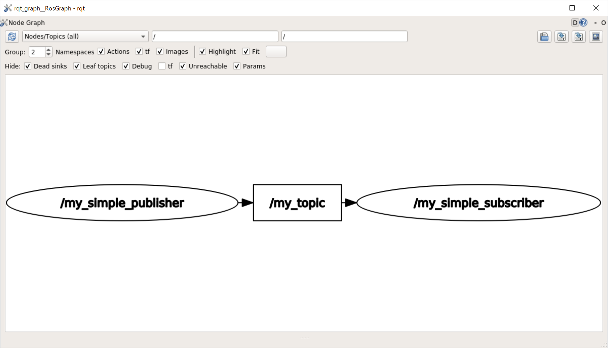

# CommandLine Tools

[前のページ](../rosparam)

[目次](../../)

[ROS WikiのCommandLine Toolsのページ](http://wiki.ros.org/ja/ROS/CommandLineTools)


## 概要
ターミナル上で使用可能な，ROS環境の解析に有用なコマンドラインツールのうちよく使うものをいくつか紹介します．

前ページで作成したmy_tutorial.launchを実行したうえで，別のターミナルでこれから説明するコマンドを打って表示を確認してみましょう．

my_tutorial.launch
```xml
<launch>
    <arg name="mode" default="true"/>
    <group if="$(arg mode)">
        <node pkg="my_ros_tutorial" type="my_simple_publisher" name="my_simple_publisher" output="screen"/>
        <node pkg="my_ros_tutorial" type="my_simple_subscriber" name="my_simple_subscriber" output="screen"/>
    </group>
</launch>
```

## rostopic
### rostopic list
```shell
decwest@DESKTOP-PRFDO60:~/catkin_ws$ rostopic list
/my_topic
/rosout
/rosout_agg
```
現在実行されているROS環境で流れているトピック一覧を表示できます．めちゃくちゃ使います．

### rostopic echo
```shell
decwest@DESKTOP-PRFDO60:~/catkin_ws$ rostopic echo /my_topic
data: "hello world"
---
data: "hello world"
---
data: "hello world"
---
data: "hello world"
---
data: "hello world"
```
`rostopic echo トピック名`で，トピックの中身を表示することができます．トピックがパブリッシュされたタイミングで中身が表示されます．
これも非常によく使います．rostopic listでトピック一覧表示した後に見たいトピック名をコピペしてrostopic echoで表示するフローをよく行います．

### rostopic info
topicの型や，topicをpublish, subscribeしているノードの情報等を見ることができます．
```
decwest@DESKTOP-PRFDO60:~/catkin_ws$ rostopic info /my_topic
Type: std_msgs/String

Publishers:
 * /my_simple_publisher (http://DESKTOP-PRFDO60:39999/)

Subscribers:
 * /my_simple_subscriber (http://DESKTOP-PRFDO60:39597/)
```

### rostopic hz
```
decwest@DESKTOP-PRFDO60:~/catkin_ws$ rostopic hz /my_topic
subscribed to [/my_topic]
average rate: 9.995
        min: 0.100s max: 0.101s std dev: 0.00033s window: 10
average rate: 9.998
        min: 0.099s max: 0.101s std dev: 0.00035s window: 20
average rate: 10.000
        min: 0.099s max: 0.101s std dev: 0.00032s window: 30
average rate: 9.999
        min: 0.099s max: 0.101s std dev: 0.00039s window: 40
```
`rostopic hz トピック名`で，トピックがpublishされる周波数を調べることができます．

### rostopic pub
私が使用するのはごく稀ですが，一応紹介します．
`rostopic pub [topic] [msg_type] [トピックの中身]`とコマンドを打つことでコマンド上でトピックのパブリッシュを行えます．
ただ，トピックの中身を直打ちするのが結構大変です．
詳細はROS Wikiの[使い方](http://wiki.ros.org/ja/ROS/Tutorials/UnderstandingTopics#rostopic_pub_.2BMJJPfzBG-)をご覧ください．

## rosnode
### rosnode list
```
decwest@DESKTOP-PRFDO60:~/catkin_ws$ rosnode list
/my_simple_publisher
/my_simple_subscriber
/rosout
```
現在実行されているROS環境で実行されているノードの名前一覧を表示できます．

### rosnode info
```
decwest@DESKTOP-PRFDO60:~/catkin_ws$ rosnode list
decwest@DESKTOP-PRFDO60:~/catkin_ws$ rosnode info /my_simple_publisher
--------------------------------------------------------------------------------
Node [/my_simple_publisher]
Publications:
 * /my_topic [std_msgs/String]
 * /rosout [rosgraph_msgs/Log]

Subscriptions: None

Services:
 * /my_simple_publisher/get_loggers
 * /my_simple_publisher/set_logger_level


contacting node http://DESKTOP-PRFDO60:39999/ ...
Pid: 11124
Connections:
 * topic: /rosout
    * to: /rosout
    * direction: outbound (52871 - 127.0.0.1:59494) [10]
    * transport: TCPROS
 * topic: /my_topic
    * to: /my_simple_subscriber
    * direction: outbound (52871 - 127.0.0.1:59490) [12]
    * transport: TCPROS
```
`rosnode info ノード名`で，ノードがパブリッシュ，サブスクライブするトピックについて等の情報がわかります．

## rqt_graph
```
rqt_graph
```
今までもよく出てきたコマンドですね．


全体像の把握にはrqt_graphが一番わかりやすいと思います．ただ，GUIが使えない環境であったり，トピックの中身を直接見たい場合等はこれまで紹介したコマンドラインツールが有用だと思います．

## roscd 
```
roscd （ROSパッケージ名）
```
作業ディレクトリを，指定したROSパッケージの存在するディレクトリに一気に移動します．
ROS環境の解析コマンドではないですが，そこそこ便利なので紹介しました．

## リンク

[次のページ](../../rviz/about)

[目次](../../)


---

## 余談
### rosbag
[rosbag](http://wiki.ros.org/rosbag)というROS中で流れているトピックをすべて保存できるコマンドラインツールがあります．実験でロボットを動かす際にrosbagでトピックをすべて保存しておくと，後で家に帰ってからじっくり解析することができるので非常に便利です．興味のある方は調べてみてください．

### カスタムROS msg
本記事をもってROSの基本的な事項の章は終わりです．お疲れさまでした．次回以降はRvizによる可視化やGazeboのシミュレーションと，若干ROSノード実装から話が飛びます．これからは文字列の授受といったちゃっちい話ではなく3Dのロボットモデルの構築等を行いそれを可視化，シミュレーションするのでやりごたえもあると思います．

さて，今回はだいぶ内容を絞ったのですが，今回扱えなかった中でも[カスタムROS msg](https://qiita.com/srs/items/7ac023c549e585caeed0)はそこそこ重要な内容なので最後に紹介しておきます．今まではstd_msgs::String等の既存の型を用いてきましたが，これを自作することもできるよという話です．

基本的には既存のものを用いたほうがほかの人も使いやすいので良いのですが，例えばセンサから取得した情報はセンサによって異なるのでユーザーがカスタムROS msgを適宜作成する必要があると思います．
興味のある方は是非ご覧ください．