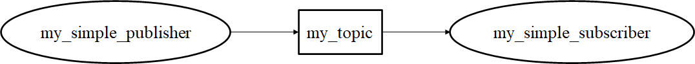

# トピック通信実践

[前のページ](../about/)

[目次](../../)

## 概要
実際に手を動かしながらROSで非常に重要な概念であるトピック通信について理解を深めます．

[ROS Wiki公式のチュートリアル](http://wiki.ros.org/ROS/Tutorials/WritingPublisherSubscriber%28c%2B%2B%29)

## ROSパッケージの作成

```shell
cd ~/catkin_ws/src
catkin_create_pkg my_ros_tutorial std_msgs roscpp rospy
```

**各行の説明**

+ `~/catkin_ws/src`に移動
+ ROSパッケージを作成
    - catkin_create_pkgはROSパッケージを作成するコマンド
    - catkin_create_pkg <パッケージ名> <依存するパッケージの名前>
    - std_msgsはIntやFloat，StringといったROSの基本的なトピックの型を利用する際に必要
    - roscppはC++で，rospyはpythonでコーディングする際に必要
    - 基本的にはstd_msgs, rospy, roscppは含めておくとよい


## ROSノードの実装
ここではC++で実装します．余談にPythonでの実装例も載せています．

### これから作るもの

my_simple_publisherという名前のpublisher，my_simple_subscriberという名前のsubscriberを実装します．

my_simple_publisherはmy_topicという名前のトピックをpublish，my_simple_subscriberはmy_topicという名前のトピックをsubscribeするようにします．

my_topicの型は[std_msgs::String](http://docs.ros.org/en/noetic/api/std_msgs/html/msg/String.html)として，"hello world!"という文字列を格納するという設計にします．




### 実装
先程catkin_create_pkgで作成したmy_ros_tutorialパッケージにはsrcディレクトリが自動生成されています．
srcディレクトリの中に以下のファイルを作成します．

参考

[http://wiki.ros.org/ROS/Tutorials/WritingPublisherSubscriber%28c%2B%2B%29](http://wiki.ros.org/ROS/Tutorials/WritingPublisherSubscriber%28c%2B%2B%29)

#### my_simple_publisher.cpp
```cpp
#include <ros/ros.h>
#include <std_msgs/String.h>

int main(int argc, char **argv)
{
    ros::init(argc, argv, "my_simple_publisher");
    ros::NodeHandle nh;
    ros::Publisher simple_pub = nh.advertise<std_msgs::String>("my_topic", 1);
    ros::Rate loop_rate(10);

    while (ros::ok())
    {
        std_msgs::String msg;
        msg.data = "hello world!";
        ROS_INFO("publish: %s", msg.data.c_str());
        simple_pub.publish(msg);

        ros::spinOnce();
        loop_rate.sleep();
    }
    return 0;
}
```

**各行の意味**
```cpp
#include <ros/ros.h>
#include <std_msgs/String.h>
```
コードを書くのに必要なライブラリを導入

- `#include <ros/ros.h>` ROSの標準的な機能を使うのに必要
- `#include <std_msgs/String.h>` topicの型がstd_msgs::Stringなので必要

```cpp
int main(int argc, char **argv)
{
    ros::init(argc, argv, "my_simple_publisher");
    ros::NodeHandle nh;
    ros::Publisher simple_pub = nh.advertise<std_msgs::String>("my_topic", 1);
    ros::Rate loop_rate(10);
```
メイン関数冒頭
- `ros::init`でROS環境の初期化．第三引数でノード名を指定．
- ノードを管理するNodeHandleオブジェクト生成．ここでノードの初期化が行われる．
- ROS masterに，このノードが`std_msgs::String`型のトピック`my_topic`をpublishすることを通知．（要するにpublisherの作成）
    - 第二引数はキューサイズ．publish速度が速いと相手が取りこぼしてしまう可能性があるため，ここで指定した数分過去のデータをためておき，適宜過去のデータからpublishしていくことが可能．**ただし**，その場その場のリアルタイムなデータが欲しい場合，キューサイズを設定しているとリアルタイムなデータではなく過去のデータがpublishされてしまう可能性がある．（センサデータのpublish等でここがバグの温床となったケースをいくつか見たことがある）なので，個人的には過去のデータを用いたくない場合は**1**とすることを推奨している．（[ROS Wiki](http://wiki.ros.org/ROS/Tutorials/WritingPublisherSubscriber%28c%2B%2B%29)では1000となっているが）
- loopの周波数を設定している（ここでは10Hz）．詳細は後述．

```cpp
    while (ros::ok())
    {
        std_msgs::String msg;
        msg.data = "hello world!";
        ROS_INFO("publish: %s", msg.data.c_str());
        simple_pub.publish(msg);

        ros::spinOnce();
        loop_rate.sleep();
    }
    return 0;
```

メイン関数後半
- `while(ros::ok())`：ROS実行時はTrue，すなわち無限ループ．Ctrl-Cが押される等，ROSのシャットダウンが入るとfalseとなりループから抜ける
- `std_msgs::String`型のmsgという名前の変数を宣言
- msg.dataに"hello world!"を代入
    - `std_msgs::String`でググってみよう．[このサイト](http://docs.ros.org/en/noetic/api/std_msgs/html/msg/String.html)が見つかるはず．トピックの中身が確認できる．`std_msgs::String`はstring型の`data`という名前のメンバ変数を持っているようなので，`msg.data = "hello world!";`とした．
- ROS_INFOはprintfと一緒でターミナルに表示できる．ただ，表示された時刻や表示したノードの情報も含まれるのでROSでは基本ROS_INFOを用いる．文法はprintfと同じなので省略．
    - %sとか忘れたわって場合は`ROS_INFO_STREAM`を用いるとC++のcoutみたいな書き方ができる．
    - 当たり前だが，もちろんprintfやcoutを普通に使ってもよい．あくまでROSはフレームワークを提供しているだけで，全部がROSの世界に染まっている必要はない．
- `simple_pub.publish(msg);`：ここでpublishが行われている．先程作ったpublisherに作成したmsgを渡すとこのmsgが`my_topic`という名前のトピックでpublishされる．
- `ros::spinOnce();`：詳細はsubscriberの項で解説する.
- `loop_rate.sleep();`先程`loop_rate(10)`と定めたが，ここではloopの周波数が10Hzになるように，すなわちループ一回当たりの所要時間が0.1sとなるようにうまく待機して調整してくれている． これを入れない場合は，純粋なwhileで高速ループする．
    - 高速でぶん回さず，周波数を整えるメリットとしては計算負荷削減や各ノードのループ周波数をそろえてsubscribeの取りこぼしを防ぐ等が考えられる．

- Ctrl-C等で`whlie(ros.ok())`を抜けたら`return 0;`でプログラム終了

#### my_simple_subscriber.cpp
```cpp
#include <ros/ros.h>
#include <std_msgs/String.h>

void mytopicCallback(const std_msgs::String &msg)
{
    ROS_INFO("subscribe: %s", msg.data.c_str());
}

int main(int argc, char **argv)
{
    ros::init(argc, argv, "my_simple_subscriber");
    ros::NodeHandle nh;
    ros::Subscriber sub = nh.subscribe("my_topic", 1, mytopicCallback);

    ros::spin();
    return 0;
}
```

**各行の意味**

main関数のノードハンドラまではpublisherと同様なので割愛．

```cpp
    ros::Subscriber sub = nh.subscribe("my_topic", 1, mytopicCallback);

    ros::spin();
    return 0;
```
- ROS masterに，このノードがstd_msgs::String型のトピックmy_topicをsubscribeすることを通知．（要するにsubscriberの作成）
    - 第二引数はキューサイズ．publisherのところで述べたことと同様に，過去のデータを使用しない場合は1を推奨．
    - 第三引数はコールバック関数の登録．トピックをサブスクライブするとここで指定したコールバック関数が実行されるようになる．コールバック関数の中身は後程見る．
- `ros::spin()`でトピックのサブスクライブを監視します．無限ループになっていて，サブスクライブを検知したらコールバック関数が呼び出されます．Ctrl-Cが押される等，ROSのシャットダウンが入ると無限ループから抜けます．
    - 先程登場した`ros::spinOnce()`と何が違うのか？spinOnceは内部に無限ループを含んでおらず，spinOnceのタイミングでコールバックが呼び出されます（サブスクライブがあった場合）．
    - `ros::spin()`は`ros::spinOnce()`を用いて実質以下のように書けると思います．
        ```cpp
        while (ros::ok())
        {
            ros::spinOnce();
        }
        ```
    - ところで，先程のpublisherはサブスクライブを行っていないので，実はspinOnceの記述は必要ありません．ただ，勉強のために書いておきました．

```cpp
void mytopicCallback(const std_msgs::String &msg)
{
    ROS_INFO("subscribe: %s", msg.data.c_str());
}
```

コールバック関数です．
- 引数としてサブスクライブしたトピックのメッセージが入ってきます．ここではmsgという名前にしています．
    - &をつけることでC++の参照渡しにしています．こうするとコピーが発生しないのでメモリや時間効率が良くなります．また，constをつけることで定数であることを明示しています．
    [C++の引数の渡し方で参考になるサイト](https://qiita.com/agate-pris/items/05948b7d33f3e88b8967)
    - [ROS Wiki](http://wiki.ros.org/ROS/Tutorials/WritingPublisherSubscriber%28c%2B%2B%29)ではBoostライブラリの[shared_ptr](https://www.boost.org/doc/libs/1_37_0/libs/smart_ptr/shared_ptr.htm)を用いています．私は普段はあまり理解せずにこちらを用いています．
- ROS_INFOで受け取ったメッセージのデータを表示することで，ただしくサブスクライブできているか見ています．

### ビルドの設定
my_ros_tutorialパッケージに自動生成されているCMakeLists.txtを編集して作成したcppファイルをビルド対象にします．
VS CodeでCMakeの拡張機能を入れると色がついて見やすいです．

```cmake
cmake_minimum_required(VERSION 3.0.2)
project(my_ros_tutorial)

find_package(catkin REQUIRED COMPONENTS
  roscpp
  rospy
  std_msgs
)

catkin_package(
#  INCLUDE_DIRS include
#  LIBRARIES my_ros_tutorial
#  CATKIN_DEPENDS roscpp rospy std_msgs
#  DEPENDS system_lib
)

include_directories(
# include
  ${catkin_INCLUDE_DIRS}
)

add_executable(my_simple_publisher src/my_simple_publisher.cpp)
target_link_libraries(my_simple_publisher ${catkin_LIBRARIES})

add_executable(my_simple_subscriber src/my_simple_subscriber.cpp)
target_link_libraries(my_simple_subscriber ${catkin_LIBRARIES})
```
最後の4行を追記しています．publisherとsubscriberで名前が違うだけでやっていることは一緒なのでsubscriberのところを例に意味を説明します．
```Cmake
add_executable(my_simple_subscriber src/my_simple_subscriber.cpp)
```
my_simple_subscriberという実行ファイルをsrc/my_simple_subscriber.cppから生成します．
```CMake
target_link_libraries(my_simple_subscriber ${catkin_LIBRARIES})
```
target_link_librariesで，my_simple_subscriberを作成する際に使用するライブラリをリンクさせることができますが，ROSでは`${catkin_LIBRARIES}`という環境変数を指定すれば基本的にはokです．


### ビルド
```
catkin build
```
ビルドすることで初めて実行ファイルが生成されます．
コードやCMakeLists.txtがミスっているとここでエラーが出るので，エラーメッセージを見ながら修正しましょう．

## 動作確認
複数のターミナルを用います．

**一つ目のターミナル**
```bash
roscore
```
ros masterを起動します．

**二つ目のターミナル**
```bash
rosrun my_ros_tutorial my_simple_publisher
```
rosrunコマンドでrosノードを起動します．
my_ros_tutorialのmy_simple_publisherを実行します．my_simple_publisherは，先程CMakeLists.txtで指定した，生成される実行ファイルの名前です．

**三つ目のターミナル**
```bash
rosrun my_ros_tutorial my_simple_subscriber
```
subscriberを実行します．

以下のようにpublisherのROS_INFO，subscriberのコールバック関数内のROS_INFOによってhelo world!が10Hzで表示されればokです．


概形確認
```
rqt_graph
```
rqt_graphというコマンドを打つと，ROS nodeとtopicの関係を以下のように可視化することができます．


## 演習問題
### 1. "hello world!"ではなく，"introduction-to-ros!"というデータをpublish, subscribeしてみよう

[解答例](./answer/)


## リンク
[次のページ](../rosparam/)

[目次](../../)

---

### 余談

#### package.xml
catkin_create_pkgすると自動生成されるファイルの一つです．ROS packageに関する情報が記載されており，ROS側はpackage.xmlが配置されているディレクトリをROSパッケージだと認識します．

パッケージ製作者の名前やメールアドレスといった事務的な情報から，このROSパッケージが依存している他のROSパッケージやライブラリの情報等が記載されており，特に後者は重要です．
興味のある方は以下のリンクを読んでみてください．

[ROS講座97 CMakeList.txtとpackage.xmlの書き方](https://qiita.com/srs/items/30c81c3f26f1987b0afa)

[野良packageへ依存したROS packageのビルドを簡単にする](https://qiita.com/strv/items/dbde72e20a8efe62ef95)

[ROS Wiki](http://wiki.ros.org/catkin/package.xml)

#### PythonでのROSノード実装例

my_simple_publisher.py
```python
#!/usr/bin/env python
import rospy
from std_msgs.msg import String

def publisher():
    rospy.init_node('my_simple_publisher')
    simple_pub = rospy.Publisher('my_topic', String, queue_size=1)

    r = rospy.Rate(10)
    while not rospy.is_shutdown():
        str = "hello world!"
        rospy.loginfo("publish: %s", str)
        pub.publish(str)
        r.sleep()

if __name__ == '__main__':
    try:
        publisher()
    except rospy.ROSInterruptException: pass
```
※roscppと異なり，rospyではspinOnceを記述しなくても勝手にcallbackを呼び出してくれます．（今回は関係ありませんが）

my_simple_subscriber.py
```python
#!/usr/bin/env python
import rospy
from std_msgs.msg import String

def mytopicCallback(msg):
    rospy.loginfo("subscribe: %s", msg.data)

def subscriber():
    rospy.init_node('my_simple_subscriber')
    rospy.Subscriber("my_topic", String, mytopicCallback)
    rospy.spin()

if __name__ == '__main__':
    subscriber()
```

C++のコードと比較すれば各行の意味は察せると思います．

NodeHandle等もないし，やっぱりPythonのほうが書くのは圧倒的に楽です．

また，ビルドが必要ないのでCMakeLists.txtを編集したりcatkin buildする必要もないです．

今回は逆にCMakeLists.txtやcatkin buildについても説明するためにまずはC++で説明しました．

#### C++ vs Python
じゃあ全部Pythonでいいじゃんと思えてきますが，Pythonは実行時間が遅いという欠点があります．

私は作成するROSノードの仕様によって言語を選択していて，例えばロボットのモータを回す制御量決定や経路計画のコードみたいな比較的リアルタイム性が求められるROSコードにはC++を用い，この行動が終わったら次はこの行動に移ってといったタスク管理のような高レイヤのROSコードはPythonで書いたりしています．

とはいえ割と気分で，高速で回したいときかつちゃんと書きたいときはC++，適当にサクッと実装したいときはPythonのような感じになってしまっているかもしれません．

あと，画像処理等Pythonのライブラリが非常に強力な分野のコードはPythonで書いてしまうことが私は多いです．
