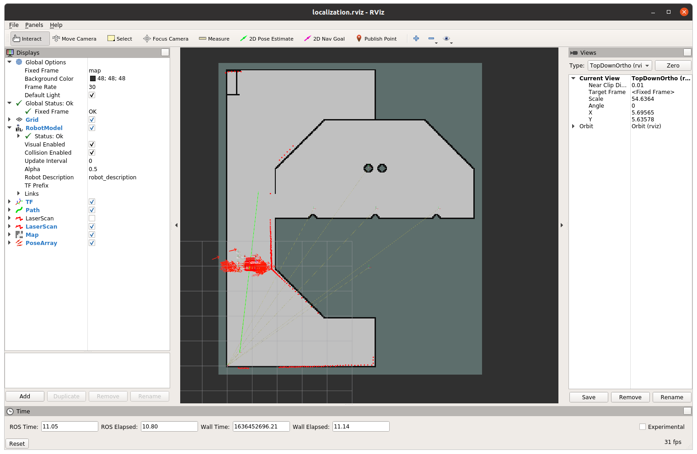
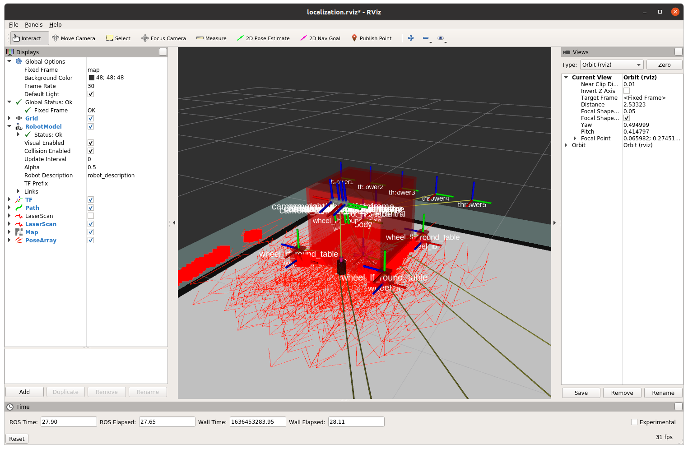

# Rvizとは

[前のページ](../../fundamental/roslaunch)

## Rvizとは

Rvizとは，ROSに付随する可視化ツールです．
ROSのトピックやロボットモデル等を可視化し，状況把握やデバッグを容易にします．

## 可視化例

この写真では，ロボットの通る経路や周囲の障害物情報，地図，自己位置推定のパーティクル等が可視化されています．

前回作成したROSトピックは文字列型だったのでコマンドで確認できました．しかし，画像を含んだり，座標値で表現されるようなROSトピックはコマンド上より実際にグラフィカルに表示したほうがわかりやすいです．

別の角度から見てみました．これはロボットモデルです．Rviz上ではROSトピックだけでなくこのようなロボットのモデルも可視化することができます．ロボットを動かすと，実際にこのロボットモデルがRviz上で動き，ロボットの動作を可視化することができます．

本記事では，これからこのロボットモデルの作成方法について書いていきます．

## リンク

[次のページ](../urdf/)

[目次](../../)

---

## 余談
上記画像は以下のリポジトリのシミュレータの画像となっています．

https://github.com/KeioRoboticsAssociation/nhk2021_ilias

git cloneしてREADMEに従ってインストールすれば上記画像を各自の環境で再現することができるので，興味のある方は遊んでみてください．
