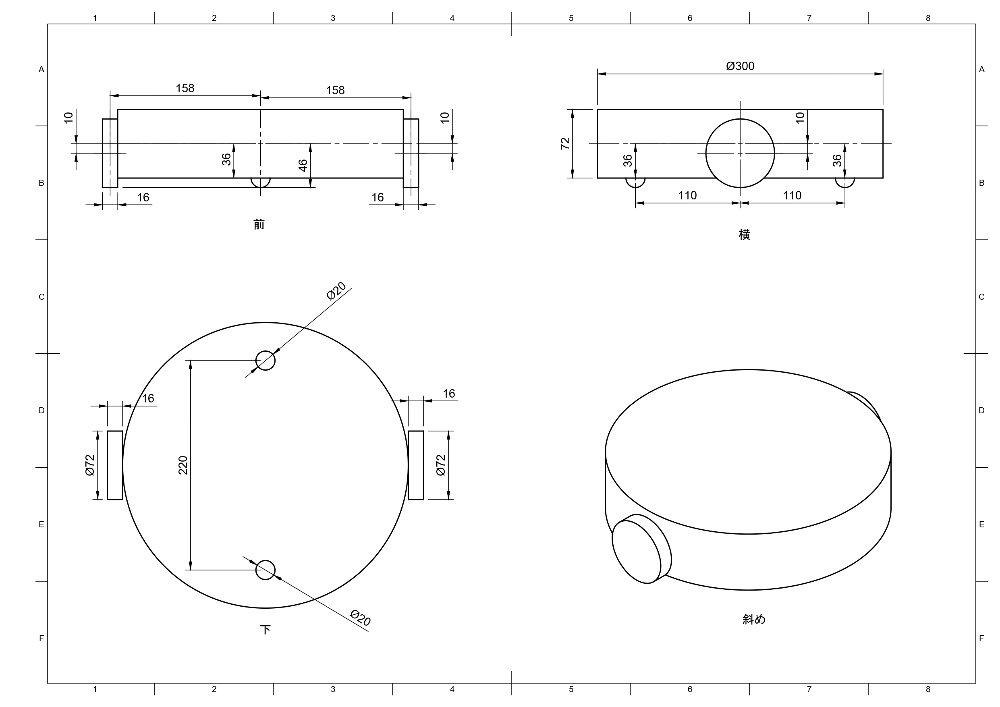

# 演習：ルンバのモデル作成

[前のページ](../urdf/)

## 概要

前ページで学んだことを活かして，ルンバのモデルを作成しましょう．

## ルンバの寸法
単位はmmです．

## 演習
以下の手順に沿ってルンバのモデルを作成しましょう．

roomba.urdfに記述していきます．

### リンク作成
1. base_linkを作成する
1. 円柱でルンバの車体body_linkを作成する
    - 半径150mm, 高さ72mmの円柱body_link：白色
1. 球でルンバのキャスターball_linkを作成する
    - 半径10mmのキャスターball_link_front, ball_link_back：白色
1. 円柱でルンバの車輪wheel_linkを作成する
    - 半径36mm, 高さ16mmの円柱wheel_link_right, wheel_link_left：黒色
### ジョイント作成
1. base_linkとbody_linkの固定ジョイントbody_jointを作成する
1. body_linkとball_linkの固定ジョイントball_joint_front, ball_joint_backを作成する
    - 補足：一般的に，ロボット座標系はロボット前方をx軸，ロボット上方をz軸，ロボット左方をy軸となるように設定します．なので，base_linkやbody_linkのx軸がロボット前方になるようにしましょう．すなわち，ball_link_frontはbody_linkのx座標正方向に0.11mのところに設置するようにしましょう．

    
    
1. body_linkとwheel_linkの回転ジョイントwheel_joint_right, wheel_joint_leftを作成する

解答は[こちら](./answer/)

## リンク

[次のページ](../../gazebo/)

[目次](../../)

---

## 余談
### xacro
