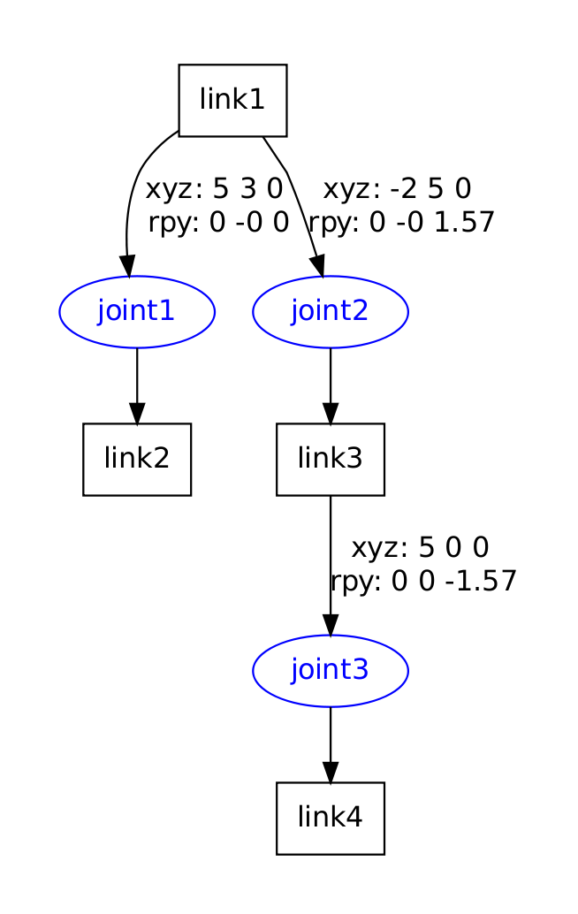
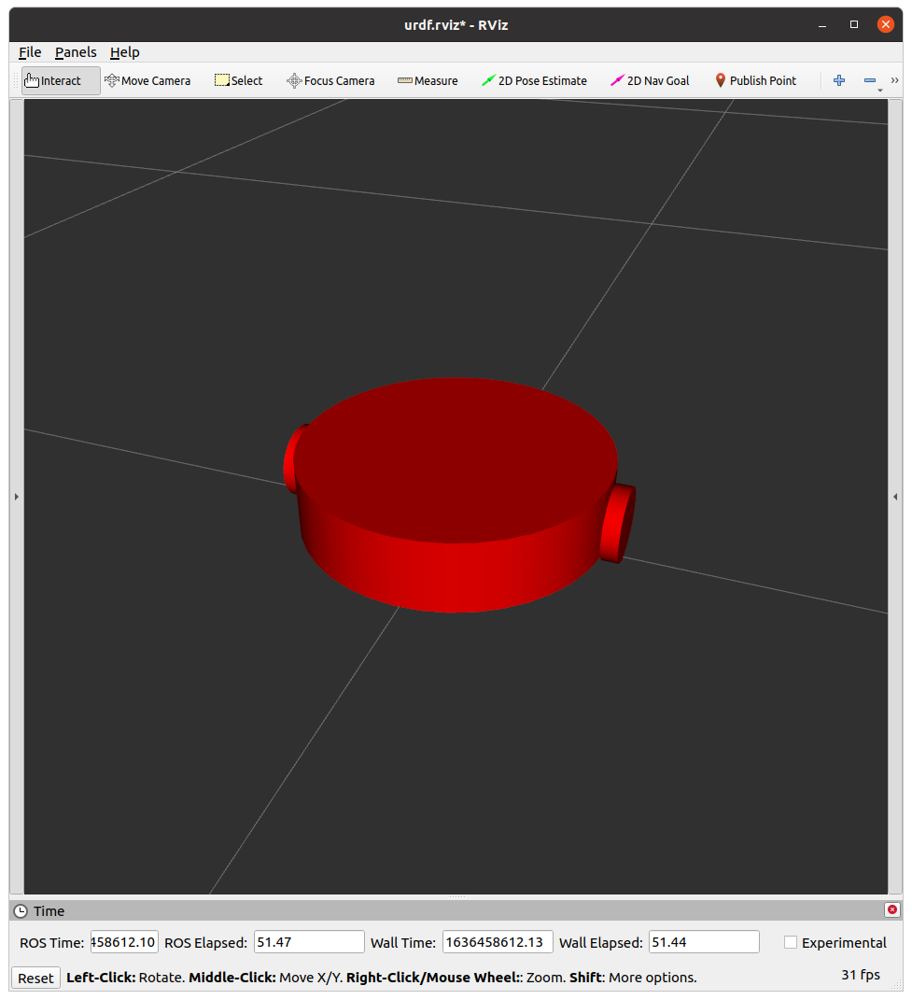
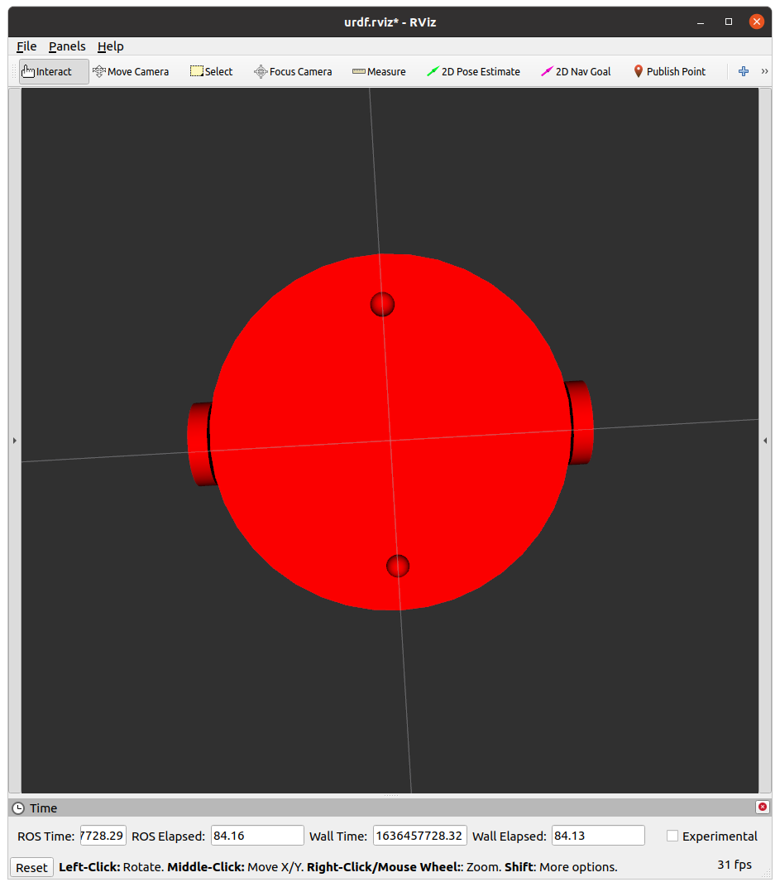
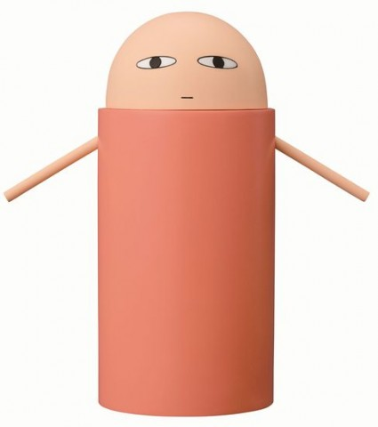
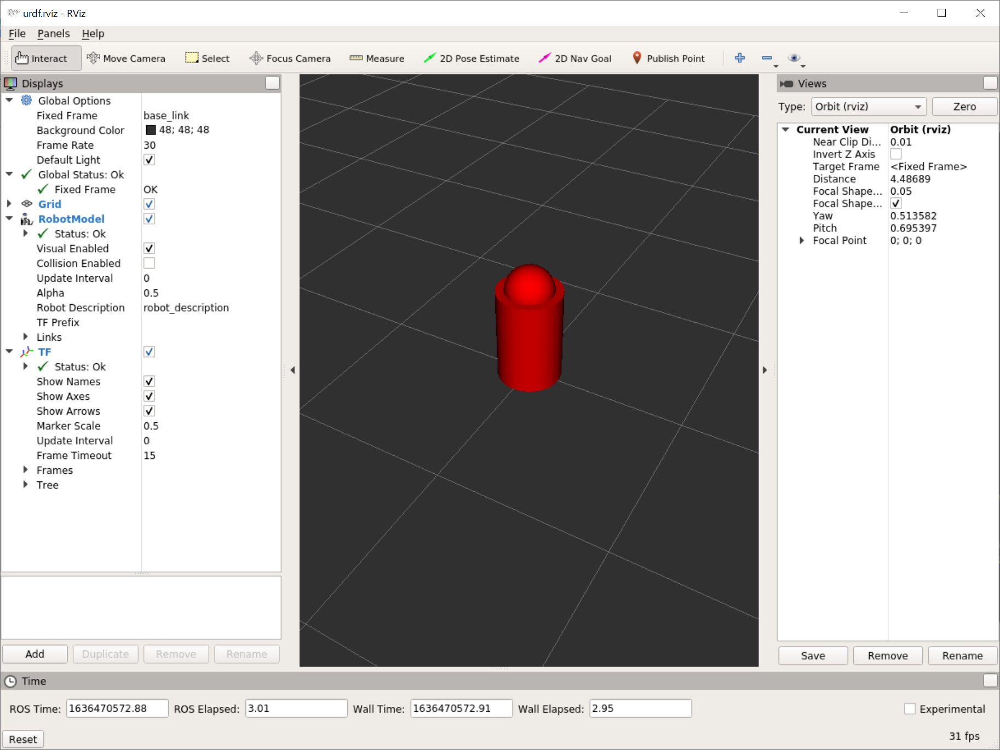
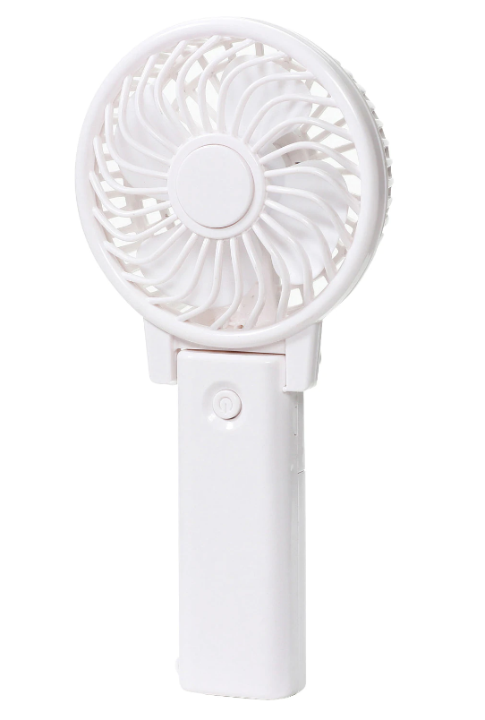
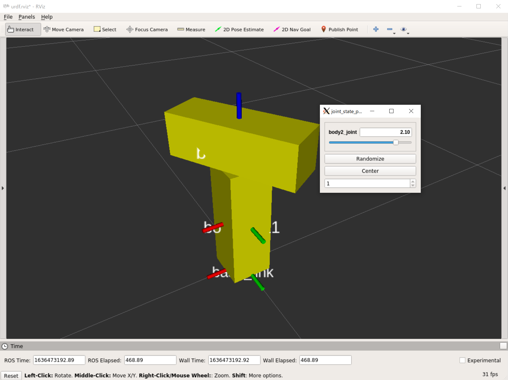

# ロボットモデルの作成：URDF

[前のページ](../rviz/)


## 概要

本記事ではロボットモデルの作成方法について説明します．

ロボットモデルはURDF (Unified Robotics Description Format) という形式で記述されます．

まず，URDFの考え方について記述します．
次に，コードの書式を実際にモデルを作成しながら確認します．


## URDFの考え方


図1



図2

[ROS wiki](http://wiki.ros.org/ja/urdf/Tutorials/Create%20your%20own%20urdf%20file)より引用

URDFによるモデルの記述は，**リンク**と**ジョイント**に分けて考えます．

- リンク

    ロボットを構成するパーツです．ロボットをいくつかのパーツに分割し，それらを接続することでロボットモデルを作成します．パーツは**直方体**，**円柱**，**球**の基本図形，およびCADの3Dモデル (Collada, STL) で表現できます．今回は基本図形のみ用います．

- ジョイント

    リンク同士を接続するものです．親リンク，子リンクを決め，親リンクから見た子リンクの位置を記述することでジョイントを表現します．図1と図2を比較し，親リンクの座標系で子リンクの座標系の位置が表示されている感覚をつかんでください．


## URDFでモデル作成
---
注意：本記事では，混乱を避けるためこれから作成したいモデルに必要最小限なもののみ紹介します．
それ以外にも詳しく知りたい方は以下をご覧ください．

[link elements](http://wiki.ros.org/urdf/XML/link)

[joint elements](http://wiki.ros.org/urdf/XML/joint)

---

本講座では，最終的に以下のルンバのようなモデルを作成することを目指します．このモデルを作成するには，円柱と球のリンクを作成し，ジョイントで適切に接続することが必要です．また，接続には，車体とキャスター間のような固定のものと，車体と車輪の間のような回転するものがあります．

そこで，本記事では
- リンク
  - 円柱
  - 球
- ジョイント
  - 固定
  - 回転

の作成について練習します．




## 1. 円柱と球リンクの作成および固定ジョイント
以下に示す銀魂のジャスタウェイ的なものの作成を通して円柱，球リンクおよび固定ジョイントの作成方法を学びます．ただし，手は省略します．



[ジャスタウェイ](https://dic.nicovideo.jp/a/%E3%82%B8%E3%83%A3%E3%82%B9%E3%82%BF%E3%82%A6%E3%82%A7%E3%82%A4)

### 作成するリンク
- ロボットの原点を表すbase_link
- 半径20cm, 高さ60cmの円柱body_link
- 半径15cmの球head_link

### 作成するジョイント
- base_linkから上に30cmのところにbody_linkがくるように記述された固定ジョイント
- body_linkの重心から上に30cmのところにhead_linkがくるように記述された固定ジョイント

### URDF作成準備
以下をインストール
```bash
sudo apt update
sudo apt-get install -y liburdfdom-tools ros-noetic-urdf-tutorial ros-noetic-joint-state-publisher-gui
```

### パッケージ作成
```bash
cd ~/catkin_ws/src/
catkin_create_pkg my_urdf_tutorial std_msgs rospy roscpp
```

### URDFファイル作成
my_urdf_tutorial/urdfディレクトリ内に以下を作成

justaway.urdf

```xml
<robot name="justaway">

  <link name="base_link"/>

  <link name="body_link">
    <visual>
      <geometry>
        <cylinder radius="0.2" length="0.6"/>
      </geometry>
      <origin xyz="0 0 0" rpy="0 0 0"/>
      <material name="red">
        <color rgba="1.0 0.0 0.0 2.0"/>
      </material>
    </visual>
    <collision>
      <geometry>
        <cylinder radius="0.2" length="0.6"/>
      </geometry>
      <origin xyz="0 0 0" rpy="0 0 0"/>
    </collision>
  </link>

  <link name="head_link">
    <visual>
      <geometry>
        <sphere radius="0.15"/>
      </geometry>
      <origin xyz="0 0 0" rpy="0 0 0"/>
      <material name="red">
        <color rgba="1.0 0.0 0.0 2.0"/>
      </material>
    </visual>
    <collision>
      <geometry>
        <sphere radius="0.15"/>
      </geometry>
      <origin xyz="0 0 0" rpy="0 0 0"/>
    </collision>
  </link>
  
  <joint name="body_joint" type="fixed">
    <parent link="base_link"/>
    <child  link="body_link"/>
    <origin xyz="0 0 0.30" rpy="0 0 0" />
  </joint>

  <joint name="head_joint" type="fixed">
    <parent link="body_link"/>
    <child  link="head_link"/>
    <origin xyz="0 0 0.30" rpy="0 0 0" />
  </joint>

</robot>
```

### 説明
roslaunchと同様にXML表記です．
#### `<robot>`タグ
urdfに必須で，ロボットの名前を記述します
#### `<link>`タグ
- base_link

    base_linkはいわばロボットモデルの原点で，肉を持たない空のリンクです．ロボットにはたいていこの名前のリンクを付けます．（実際はbase_footprintとか色々な流儀があります）
    以降のbody_linkの位置はbase_linkを基準に記述します．head_linkの位置は今回はbody_linkを基準に記述しますが，base_linkを基準としてもかまいません．

- body_link
```xml
  <link name="body_link">
    <visual>
      <geometry>
        <cylinder radius="0.2" length="0.6"/>
      </geometry>
      <origin xyz="0 0 0" rpy="0 0 0"/>
      <material name="red">
        <color rgba="1.0 0.0 0.0 2.0"/>
      </material>
    </visual>
    <collision>
      <geometry>
        <cylinder radius="0.2" length="0.6"/>
      </geometry>
      <origin xyz="0 0 0" rpy="0 0 0"/>
    </collision>
  </link>
```
大まかに構造を述べると，次のようになっています
- link：リンクの名前
    - visual：見た目に関する記述
        - geometry：基本図形の形状
        - origin：重心の座標
        - material：色など
    - collision：衝突判定に関する記述
        - geometry：基本図形の形状
        - origin：重心の座標

visualとcollisionは基本同じ寸法でよいですが，見た目より衝突判定を緩くしたい場合はcollisionの寸法を少し小さく書いたりします．

- geometryについて
    - 球の場合：`<sphere radius="球の半径"/>`
    - 円柱の場合：`<cylinder radius="半径" length="長さ"/>`
    - 直方体の場合：`<box size="縦 横 高さ"/>`
    - 単位はメートルです．
- originについて
    - 座標系からの相対位置
    - x, y, z, roll, pitch, yaw
    - originが0の時は，各リンクの重心が座標原点となります．基本的には，originを0とし，ジョイントで各リンクの重心の相対位置関係を記述することが多いです．
- colorについて
    - `<color rgba="r g b alpha"/>`
    - alpha値1で不透明のはずですが，なぜか2くらいにしないと不透明にならないので今回は2にしています，

head_linkもbody_linkと同様の表記なので，上記を見て解読してみましょう．

#### `<joint>`タグ
```xml
  <joint name="body_joint" type="fixed">
    <parent link="base_link"/>
    <child  link="body_link"/>
    <origin xyz="0 0 0.30" rpy="0 0 0" />
  </joint>

  <joint name="head_joint" type="fixed">
    <parent link="body_link"/>
    <child  link="head_link"/>
    <origin xyz="0 0 0.30" rpy="0 0 0" />
  </joint>
```
- joint：ジョイントの名前
    - parent：親リンクの名前
    - child：子リンクの名前
    - origin：親リンクの座標系から見た子リンクの位置．すなわち，親リンクの重心から見た子リンクの重心の位置です．

今回は，base_linkから真上に30cmのところにbody_linkの重心．
body_linkの重心から真上に30cmのところにhead_linkの重心があるため，上記のようなoriginになります．

### 確認
#### 文法チェック
```
cd ~/catkin_ws/src/my_urdf_tutorial/urdf
check_urdf justaway.urdf
```
urdfの存在するディレクトリで`check_urdf urdfファイル`とすると文法チェックできます．
うまくいくと以下のように表示されます．
```
robot name is: justaway
---------- Successfully Parsed XML ---------------
root Link: base_link has 1 child(ren)
    child(1):  body_link
        child(1):  head_link
```
#### ロボットモデル可視化
```
roslaunch urdf_tutorial display.launch model:=justaway.urdf
```
先程aptで入れたurdf_tutorialパッケージのlaunchを用いることでurdfモデルの可視化ができます．model:=urdfファイルとして引数を与えます．

成功すると以下のように表示されます．




## 2. 回転ジョイントの作成
ジャスタウェイの頭を回転させてもよくわからないので，以下のように直方体二つを回転ジョイントで接続したタケコプター的なものを作成します．（タケコプターというよりTだけど）



### 作成するリンク
- base_link
- 10cm * 10cm * 30cmの直方体body_link1：黄
- 30cm * 10cm * 10cmの直方体body_link2：黄

### 作成するジョイント
- base_linkから上に15cmのところにbody_link1が来るように記述された固定ジョイント
- body_link1の重心から上に20cmのところにbody_link2がくるように記述された回転ジョイント

### コード

takecopter.urdf

```xml
<robot name="takecopter">

  <link name="base_link"/>

  <link name="body_link1">
    <visual>
      <geometry>
        <box size="0.1 0.1 0.3"/>
      </geometry>
      <origin xyz="0 0 0" rpy="0 0 0"/>
      <material name="yellow">
        <color rgba="1.0 1.0 0.0 2.0"/>
      </material>
    </visual>
    <collision>
      <geometry>
        <box size="0.1 0.1 0.3"/>
      </geometry>
      <origin xyz="0 0 0" rpy="0 0 0"/>
    </collision>
  </link>

  <link name="body_link2">
    <visual>
      <geometry>
        <box size="0.3 0.1 0.1"/>
      </geometry>
      <origin xyz="0 0 0.0" rpy="0 0 0"/>
      <material name="yellow">
        <color rgba="1.0 1.0 0.0 2.0"/>
      </material>
    </visual>
    <collision>
      <geometry>
        <box size="0.3 0.1 0.1"/>
      </geometry>
      <origin xyz="0 0 0.0" rpy="0 0 0"/>
    </collision>
  </link>
  
  <joint name="body1_joint" type="fixed">
    <parent link="base_link"/>
    <child  link="body_link1"/>
    <origin xyz="0 0 0.15" rpy="0 0 0" />
  </joint>

  <joint name="body2_joint" type="continuous">
    <parent link="body_link1"/>
    <child  link="body_link2"/>
    <origin xyz="0 0.0 0.20" rpy="0 0 0" />
    <axis xyz="0 0 1" />
    <limit effort="0" velocity="0"/>
  </joint>

</robot>
```
回転ジョイント以外一緒なので，回転ジョイントについてのみ記述します．
```xml
  <joint name="body2_joint" type="continuous">
    <parent link="body_link1"/>
    <child  link="body_link2"/>
    <origin xyz="0 0.0 0.20" rpy="0 0 0" />
    <axis xyz="0 0 1" />
    <limit effort="0" velocity="0"/>
  </joint>
```
- `<axis>`タグ
    - x軸，y軸，z軸周り回転の単位ベクトルです．今回はプロペラみたいに横に回したいということで，これは上向きのz軸周り回転なので`<axis xyz="0 0 1" />`としています．なお，反時計回りが正で，逆回りにしたいときは-1とすればよいです．
    - 実際は，一発で所望の回転軸を当てるのは割と難しいので，適当に色々試してあったら採用みたいな感じですかね
- limitタグ
    - 回転ジョイントには必須の項目です．effortとvelocityは関節が出せる最大の速度とトルクを表し，今後Gazeboという物理シミュレータを使う上で影響してきます．今回は関係ないので適当に0にしています．

#### ロボットモデル可視化
```bash
roslaunch urdf_tutorial display.launch model:=takecopter.urdf
```

付属のGUIで色々角度を変えることができます．



次のページで，本記事で練習したことを活かしてルンバのモデリングを演習形式で行います！

## リンク

[次のページ](../practice/)

[目次](../../)


---

## 余談
### base_linkについて
