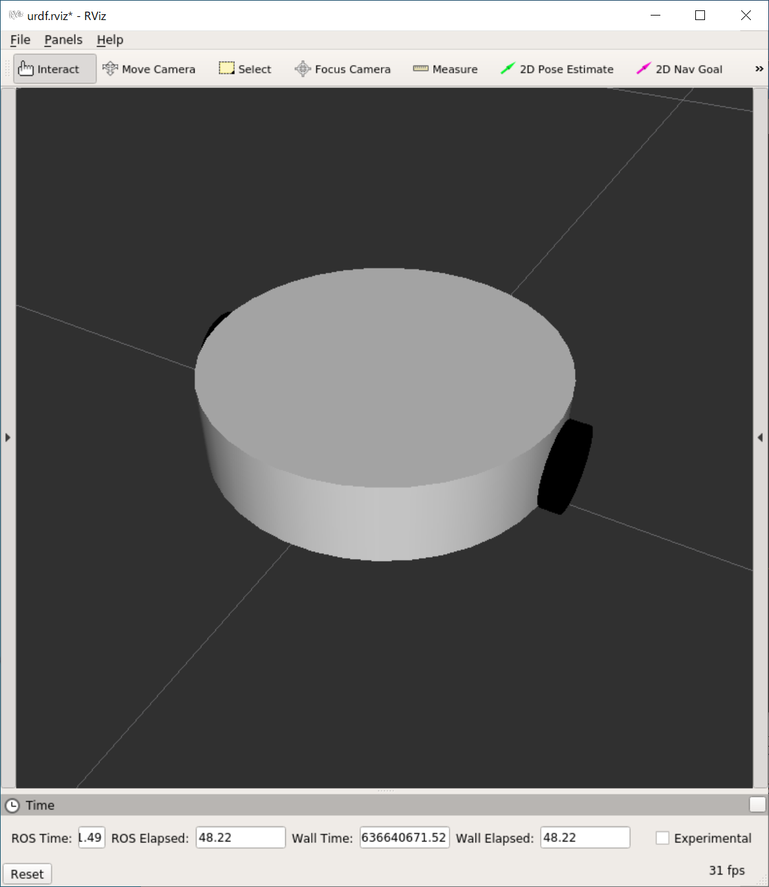
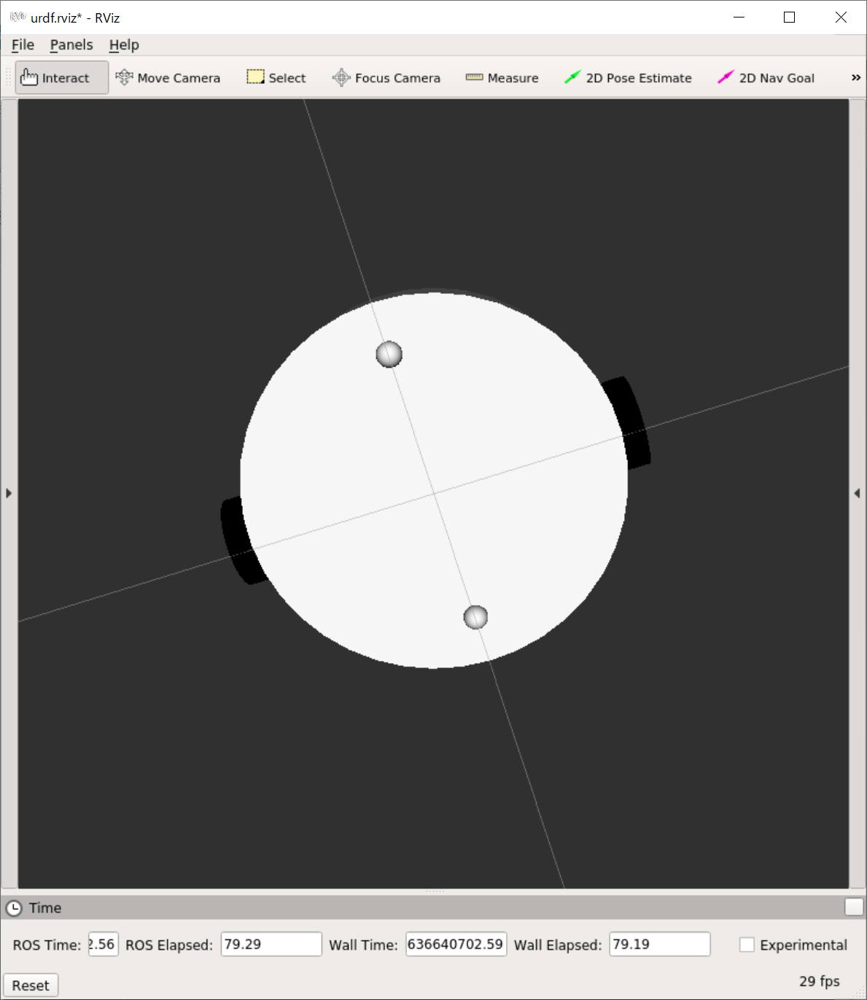
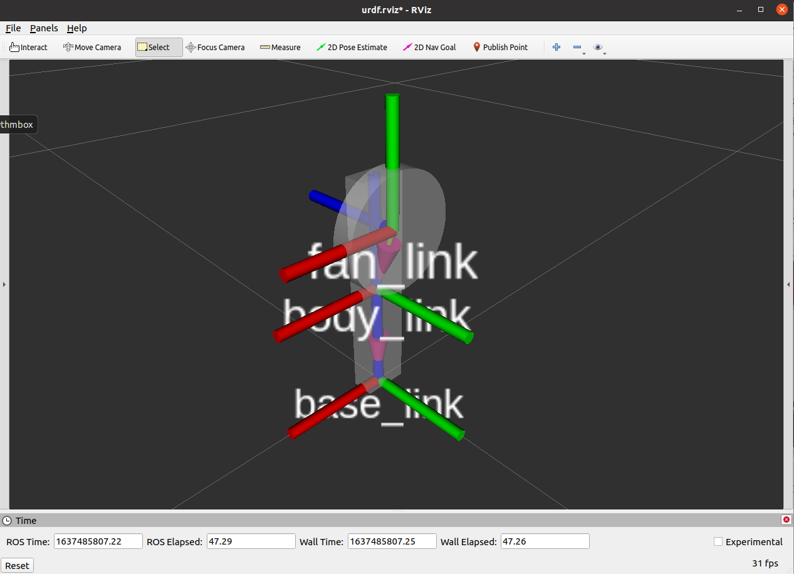
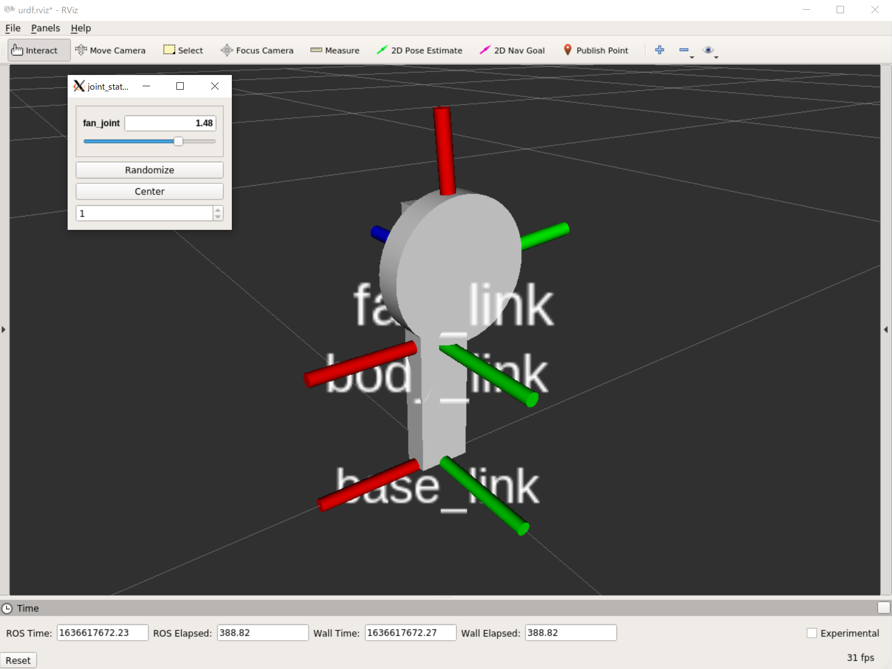

# ロボットモデルの作成：URDF

[目次](../../)

[前のページ](../about/)


## 概要

本記事ではロボットモデルの作成方法について説明します．

ロボットモデルはURDF (Unified Robotics Description Format) という形式で記述されます．

まず，URDFの考え方について記述します．
次に，コードの書式を実際にモデルを作成しながら確認します．


## URDFの考え方


図1


図2

[ROS wiki](http://wiki.ros.org/ja/urdf/Tutorials/Create%20your%20own%20urdf%20file)より引用

URDFによるモデルの記述は，**リンク**と**ジョイント**に分けて考えます．

- リンク

    ロボットを構成するパーツです．ロボットをいくつかのパーツに分割し，それらを接続することでロボットモデルを作成します．パーツは**直方体**，**円柱**，**球**の基本図形，およびCADの3Dモデル (Collada, STL) で表現できます．今回は基本図形のみ用います．

- ジョイント

    リンク同士を接続するものです．親リンク，子リンクを決め，親リンクから見た子リンクの位置を記述することでジョイントを表現します．図1と図2を比較し，親リンクの座標系で子リンクの座標系の位置が表示されている感覚をつかんでください．


## URDFでモデル作成
---
注意：本記事では，混乱を避けるためこれから作成したいモデルに必要最小限なもののみ紹介します．
それ以外にも詳しく知りたい方は以下をご覧ください．

[link elements](http://wiki.ros.org/urdf/XML/link)

[joint elements](http://wiki.ros.org/urdf/XML/joint)

---

本講座では，最終的に以下のルンバのようなモデルを作成することを目指します．このモデルを作成するには，円柱と球のリンクを作成し，ジョイントで適切に接続することが必要です．また，接続には，車体とキャスター間のような固定のものと，車体と車輪の間のような回転するものがあります．

そこで，本記事では
- リンク
  - 円柱
  - 球
- ジョイント
  - 固定
  - 回転

の作成について練習します．




## 1. 円柱と球リンクの作成および固定ジョイント
以下に示す銀魂のジャスタウェイ的なものの作成を通して円柱，球リンクおよび固定ジョイントの作成方法を学びます．ただし，手は省略します．


[ジャスタウェイ](https://dic.nicovideo.jp/a/%E3%82%B8%E3%83%A3%E3%82%B9%E3%82%BF%E3%82%A6%E3%82%A7%E3%82%A4)

### 作成するリンク
- ロボットの原点を表すbase_link
- 半径20cm, 高さ60cmの円柱body_link
- 半径15cmの球head_link

### 作成するジョイント
- base_linkから上に30cmのところにbody_linkがくるように記述された固定ジョイントbody_joint
- body_linkの重心から上に30cmのところにhead_linkがくるように記述された固定ジョイントhead_joint

### URDF作成準備
以下をインストール
```bash
sudo apt update
sudo apt install -y liburdfdom-tools ros-noetic-urdf-tutorial ros-noetic-joint-state-publisher-gui
```

### パッケージ作成
```bash
cd ~/catkin_ws/src/
catkin_create_pkg my_urdf_tutorial std_msgs rospy roscpp
```

### URDFファイル作成
my_urdf_tutorial/urdfディレクトリ内に以下を作成

justaway.urdf

```xml
<robot name="justaway">

  <link name="base_link"/>

  <link name="body_link">
    <visual>
      <geometry>
        <cylinder radius="0.2" length="0.6"/>
      </geometry>
      <origin xyz="0 0 0" rpy="0 0 0"/>
      <material name="red">
        <color rgba="1.0 0.0 0.0 1.0"/>
      </material>
    </visual>
  </link>

  <link name="head_link">
    <visual>
      <geometry>
        <sphere radius="0.15"/>
      </geometry>
      <origin xyz="0 0 0" rpy="0 0 0"/>
      <material name="red">
        <color rgba="1.0 0.0 0.0 1.0"/>
      </material>
    </visual>
  </link>
  
  <joint name="body_joint" type="fixed">
    <parent link="base_link"/>
    <child  link="body_link"/>
    <origin xyz="0 0 0.30" rpy="0 0 0" />
  </joint>

  <joint name="head_joint" type="fixed">
    <parent link="body_link"/>
    <child  link="head_link"/>
    <origin xyz="0 0 0.30" rpy="0 0 0" />
  </joint>

</robot>
```

### 説明
roslaunchと同様にXML表記です．
#### `<robot>`タグ
urdfに必須で，ロボットの名前を記述します
#### `<link>`タグ
- base_link

    base_linkはいわばロボットモデルの原点で，肉を持たない空のリンクです．ロボットにはたいていこの名前のリンクを付けます．（実際はbase_footprintとか色々な流儀があります）
    以降のbody_linkの位置はbase_linkを基準に記述します．head_linkの位置は今回はbody_linkを基準に記述しますが，base_linkを基準としてもかまいません．

- body_link
```xml
  <link name="body_link">
    <visual>
      <geometry>
        <cylinder radius="0.2" length="0.6"/>
      </geometry>
      <origin xyz="0 0 0" rpy="0 0 0"/>
      <material name="red">
        <color rgba="1.0 0.0 0.0 1.0"/>
      </material>
    </visual>
  </link>
```
大まかに構造を述べると，次のようになっています
- link：リンクの名前
    - visual：見た目に関する記述
        - geometry：基本図形の形状
        - origin：リンク座標系から見たリンクの重心の位置
        - material：色など

- geometryについて
    - 球の場合：`<sphere radius="球の半径"/>`
    - 円柱の場合：`<cylinder radius="半径" length="長さ"/>`
    - 直方体の場合：`<box size="縦 横 高さ"/>`
    - 単位はメートルです．
- originについて
    - リンク座標系から見たリンクの重心の位置
    - x, y, z, roll, pitch, yaw
    - originが0の場合，各リンクの重心はリンク座標系の原点に位置します．リンク座標系同士の位置関係はジョイントで記述されます．したがって，originを0とし，ジョイントで各リンクの重心の位置関係を記述することが多いです．
- colorについて
    - `<color rgba="r g b alpha"/>`

head_linkもbody_linkと同様の表記なので，上記を見て解読してみましょう．

#### `<joint>`タグ
```xml
  <joint name="body_joint" type="fixed">
    <parent link="base_link"/>
    <child  link="body_link"/>
    <origin xyz="0 0 0.30" rpy="0 0 0" />
  </joint>

  <joint name="head_joint" type="fixed">
    <parent link="body_link"/>
    <child  link="head_link"/>
    <origin xyz="0 0 0.30" rpy="0 0 0" />
  </joint>
```
- joint：ジョイントの名前
    - parent：親リンクの名前
    - child：子リンクの名前
    - origin：親リンクの座標系から見た子リンクの座標系の位置．すなわち，各リンクのoriginが0の場合，親リンクの重心から見た子リンクの重心の位置です．

今回は，base_linkから真上に30cmのところにbody_linkの重心．
body_linkの重心から真上に30cmのところにhead_linkの重心があるため，上記のようなoriginになります．

### 確認
#### 文法チェック
```bash
cd ~/catkin_ws/src/my_urdf_tutorial/urdf
check_urdf justaway.urdf
```
urdfの存在するディレクトリで`check_urdf urdfファイル`とすると文法チェックできます．
うまくいくと以下のように表示されます．
```
robot name is: justaway
---------- Successfully Parsed XML ---------------
root Link: base_link has 1 child(ren)
    child(1):  body_link
        child(1):  head_link
```
#### ロボットモデル可視化
```bash
roslaunch urdf_tutorial display.launch model:=justaway.urdf
```
先程aptで入れたurdf_tutorialパッケージのlaunchを用いることでurdfモデルの可視化ができます．model:=urdfファイルとして引数を与えます．

成功すると以下のように表示されます．


## 2. 回転ジョイントの作成
ジャスタウェイの頭を回転させてもよくわからないので，以下のように直方体に円柱を回転ジョイントで接続した手持ち扇風機的なものを作成します．




[モノタロウ](https://www.monotaro.com/p/5567/2838/?utm_id=g_pla&utm_medium=cpc&utm_source=Adwords&utm_campaign=246-833-4061_6466659573&utm_content=77481174716&utm_term=_380686959515__aud-536766637816:pla-879343685468&gclid=Cj0KCQiA-K2MBhC-ARIsAMtLKRsmYchzOtYxhPVyo9i_GEImy8krLFXqtiBWSH5pcB3z2mUJlHU2q9waAlN6EALw_wcB)

### 作成するリンク
- base_link
- 4cm * 2cm * 20cmの直方体body_link
- 半径5cm, 高さ2cmの円柱fan_link

### 作成するジョイント
- base_linkから上に10cmのところにbody_linkが来るように記述された固定ジョイントbody_joint
- body_linkの重心から上に6cm, 前に2cmのところにfan_linkがくるように記述された回転ジョイントfan_joint

### コード

handyfan.urdf

```xml
<robot name="handyfan">

  <link name="base_link"/>

  <link name="body_link">
    <visual>
      <geometry>
        <box size="0.04 0.02 0.20"/>
      </geometry>
      <origin xyz="0 0 0" rpy="0 0 0"/>
      <material name="white">
        <color rgba="1.0 1.0 1.0 1.0"/>
      </material>
    </visual>
  </link>

  <link name="fan_link">
    <visual>
      <geometry>
        <cylinder radius="0.05" length="0.02"/>
      </geometry>
      <origin xyz="0 0 0" rpy="0 0 0"/>
      <material name="white">
        <color rgba="1.0 1.0 1.0 1.0"/>
      </material>
    </visual>
  </link>
  
  <joint name="body_joint" type="fixed">
    <parent link="base_link"/>
    <child  link="body_link"/>
    <origin xyz="0 0 0.10" rpy="0 0 0" />
  </joint>

  <joint name="fan_joint" type="continuous">
    <parent link="body_link"/>
    <child  link="fan_link"/>
    <origin xyz="0.0 0.02 0.06" rpy="1.570796326794897 0 0" />
    <axis xyz="0 0 1" />
  </joint>

</robot>
```
回転ジョイント以外一緒なので，回転ジョイントについてのみ記述します．
```xml
  <joint name="fan_joint" type="continuous">
    <parent link="body_link"/>
    <child  link="fan_link"/>
    <origin xyz="0.0 0.02 0.06" rpy="1.570796326794897 0 0" />
    <axis xyz="0 0 1" />
  </joint>
```
- `<origin>`タグ
    - xyzについては先ほどと同様ですが，今回はrpyにも値が入っています．デフォルトだと (originが0だと) 円柱は縦向きなので，横向きになるようにfan_linkの座標系をx軸を中心に90度回転させています．
- `<axis>`タグ
    - x軸，y軸，z軸周り回転の単位ベクトルです．今回はプロペラみたいに横に回したいということで，これは上向きのz軸周り回転なので`<axis xyz="0 0 1" />`としています．なお，反時計回りが正で，逆回りにしたいときは-1とすればよいです．
    - 実際は，一発で所望の回転軸を当てるのは割と難しいので，適当に色々試してあったら採用みたいな感じですかね

#### ロボットモデル可視化
```bash
roslaunch urdf_tutorial display.launch model:=handyfan.urdf
```

付属のGUIで色々角度を変えることができます．



次のページで，本記事で練習したことを活かしてルンバのモデリングを演習形式で行います！

## リンク

[次のページ](../practice/)

[目次](../../)


---

## 余談
### base_linkについて
